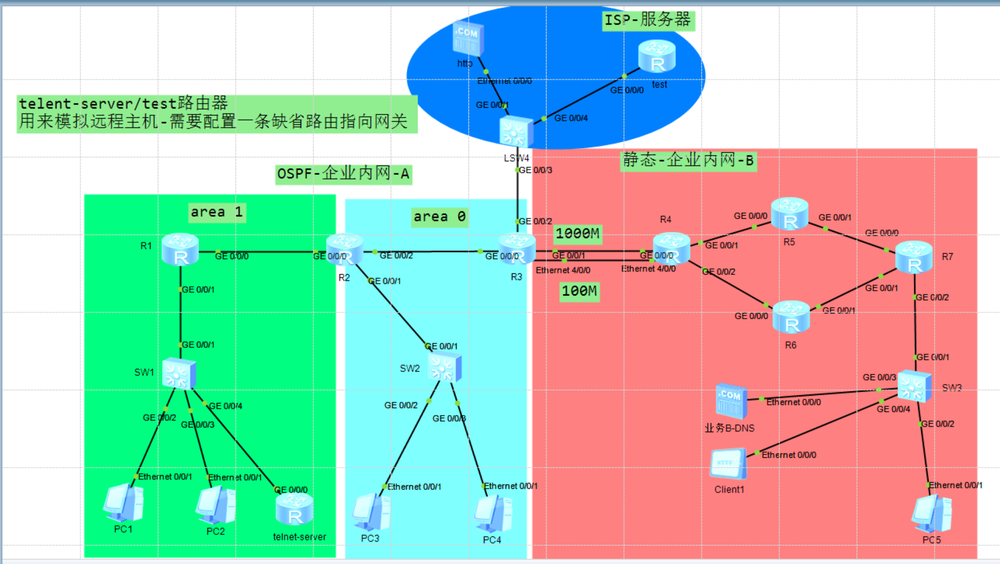
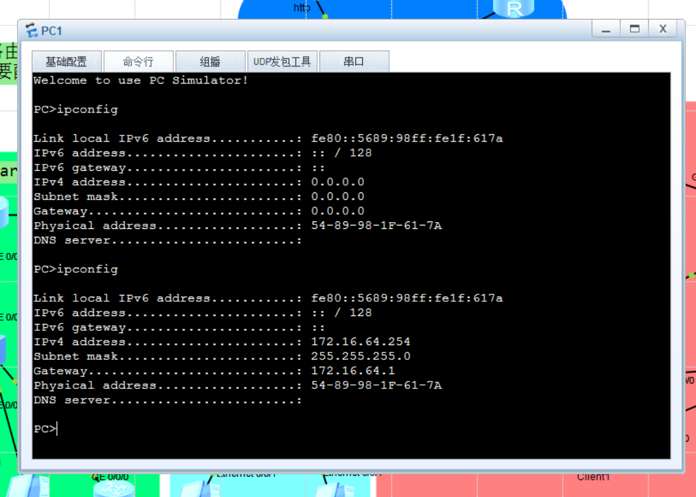
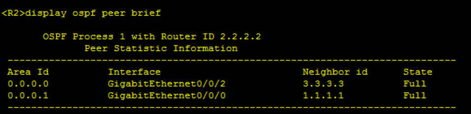
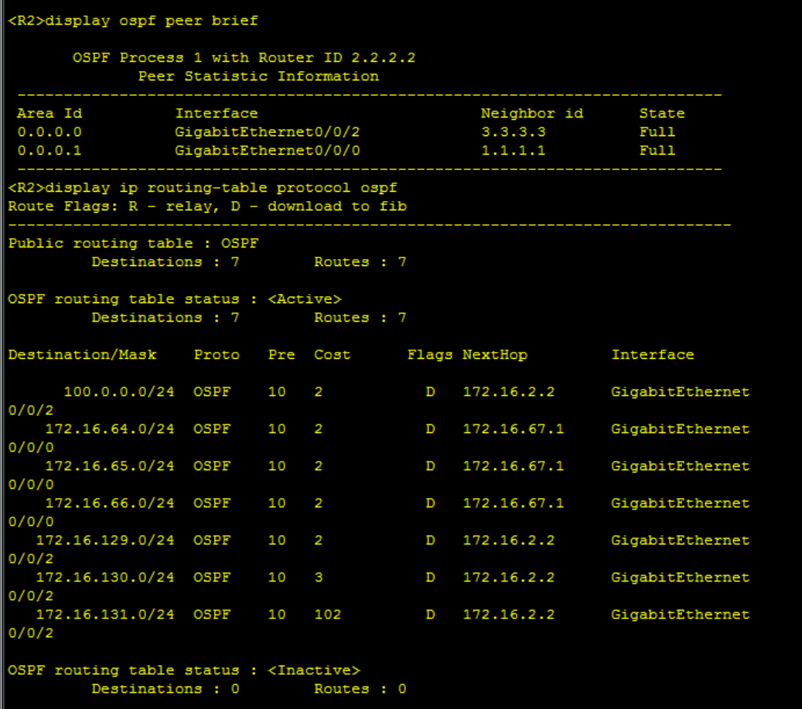
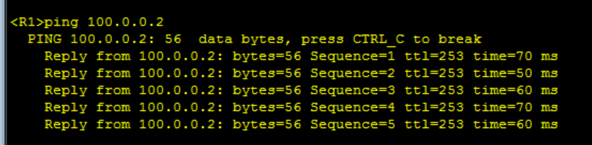
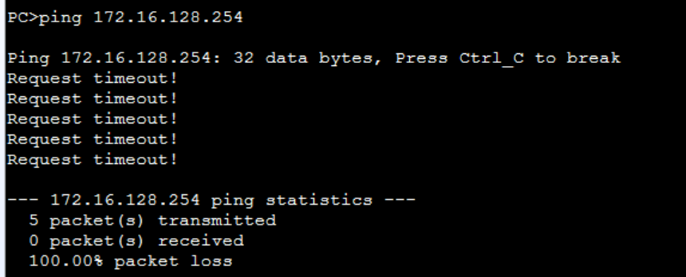
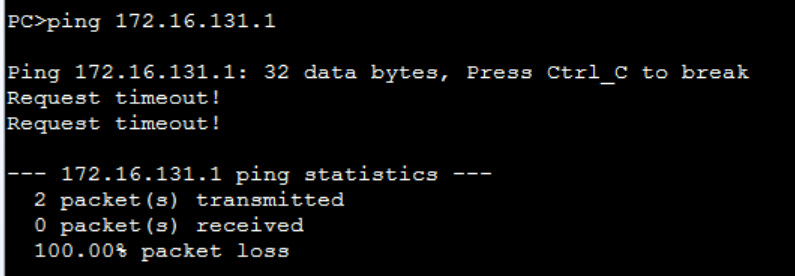
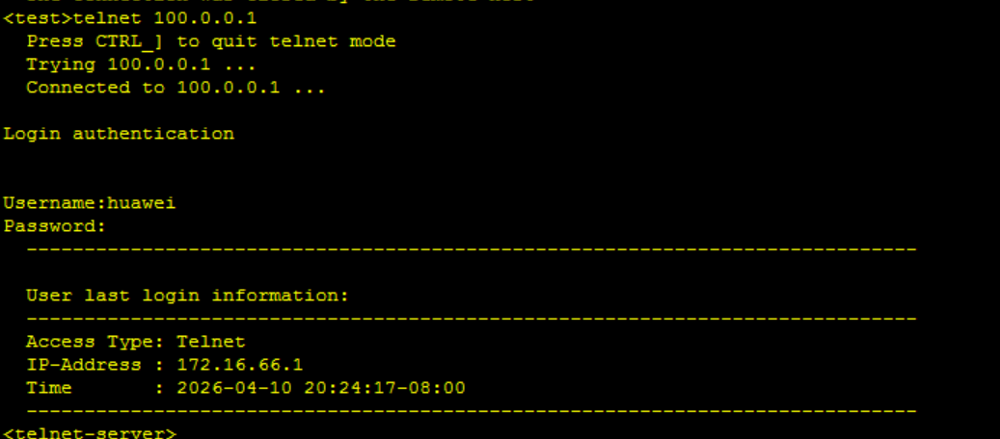

# 华为HCIA综合网络实验报告

## 一、 实验名称

基于华为 eNSP 的综合网络架构与配置实验

## 二、 实验目的

1. 掌握交换机 VLAN 的划分及 Trunk 链路的最小化透传原则。
2. 掌握路由器单臂路由（子接口）及全局 DHCP 服务的配置。
3. 掌握 OSPF 多区域的划分、精确宣告、防环汇总以及 MD5 安全认证。
4. 掌握静态路由、浮动静态路由（主备链路备份）及缺省路由的规划与配置。
5. 掌握基础 ACL（访问控制列表）的应用，实现精细化的流量控制。
6. 掌握边界路由器的 NAT（网络地址转换）及 NAT Server（端口映射）配置。
7. 掌握网络设备的 AAA 认证与 Telnet 远程登录配置。

## 三、 实验拓扑



## 四、 IP地址与VLAN规划

- **OSPF 内网区域（Area 0 / Area 1）**：包含 VLAN 10/20/30/40/50 的网段及网关规划。
- **静态业务 B 区域**：包含 VLAN 60/70 的网段及互联地址规划。
- **ISP 互联网出口区**：100.0.0.0/24 网段分配。

## 五、 实验具体需求

1.所有PC均需要通过DHCP获取IP地址-地址池名称和设备VLAN一致，例如PC1-ip pool vlan10,其中只有业务B网络用户需要访问互联网web服务-需要DNS信息。
2.交换机配置VLAN需要遵循最小VLAN透传原则
3.利用OSPF协议使内外用户互相访问-全网可达（设备Router-ID需要手工配置，和设备编号一致，例如R1-RID：1.1.1.1），并采用精准宣告的方式进行宣告（例如：172.16.64.1/24接口，宣告：172.16.64.1 0.0.0.0）
4.内网全网可达，并且需要尽可能减小路由表条目数量（汇总采用精确汇总方式），能够利用缺省省去的配置可省略，防止环路，并且保障安全（在OSPF区域0需要配置认证-采用MD5认证，密码为123456）
5.内网所有用户均可访问互联网（边界路由器配置NAT），ACL采用基础ACL，编号为2000，R3-0/0/2接口不允许宣告在内网中（包含静态）。
6.test设备需要远程登陆到内网telnet-server设备,登录账号为 huawei 密码 123456，登录权限为最高。
7.不允许VLAN 40和VLAN 50 用户访问内网B业务，acl编号为2001，不允许PC1访问PC5，ACL编号为3000。
8.R3-R4中间百兆链路作为备份链路，不允许正常情况下数据通过，需要降低优先级数值配置为100。
9.所有设备严格按照拓扑图标识进行配置，注意大小写。
10.图示中所有服务器和client设备均为体现需求，地址固定，不做更改，在配置时需求注意。clinet1用来模拟内网用户访问互联网（ISP-服务器），test设备用来测试互联网用户远程登陆内网telent-server主机。

## 六、 配置步骤与命令

### 6.1 二层交换机配置

#### SW1：

```
sysname SW1
vlan batch 10 20 30
interface GigabitEthernet0/0/1
 port link-type trunk
 port trunk allow-pass vlan 10 20 30
interface GigabitEthernet0/0/2
 port link-type access
 port default vlan 10
interface GigabitEthernet0/0/3
 port link-type access
 port default vlan 20
interface GigabitEthernet0/0/4
 port link-type access
 port default vlan 30
```

#### SW2：

```
sysname SW2
vlan batch 40 50
interface GigabitEthernet0/0/1
 port link-type trunk
 port trunk allow-pass vlan 40 50
interface GigabitEthernet0/0/2
 port link-type access
 port default vlan 40
interface GigabitEthernet0/0/3
 port link-type access
 port default vlan 50
```

#### SW3：

```
sysname SW3
vlan batch 60 70
interface GigabitEthernet0/0/1
 port link-type trunk
 port trunk allow-pass vlan 60 70
interface GigabitEthernet0/0/2
 port link-type access
 port default vlan 70
interface GigabitEthernet0/0/3
 port link-type access
 port default vlan 60
interface GigabitEthernet0/0/4
 port link-type access
 port default vlan 60
```

### 6.2 路由器配置

#### R1：

```
[V200R003C00]
#
 sysname R1
#
 snmp-agent local-engineid 800007DB03000000000000
 snmp-agent 
#
 clock timezone China-Standard-Time minus 08:00:00
#
portal local-server load flash:/portalpage.zip
#
 drop illegal-mac alarm
#
 wlan ac-global carrier id other ac id 0
#
 set cpu-usage threshold 80 restore 75
#
dhcp enable
#
acl number 3000  
 rule 5 deny ip source 172.16.64.0 0.0.0.255 destination 172.16.128.128 0.0.0.127 
 rule 10 permit ip 
#
ip pool vlan10
 gateway-list 172.16.64.1 
 network 172.16.64.0 mask 255.255.255.0 
#
ip pool vlan20
 gateway-list 172.16.65.1 
 network 172.16.65.0 mask 255.255.255.0 
#
aaa 
 authentication-scheme default
 authorization-scheme default
 accounting-scheme default
 domain default 
 domain default_admin 
 local-user admin password cipher %$%$K8m.Nt84DZ}e#<0`8bmE3Uw}%$%$
 local-user admin service-type http
#
firewall zone Local
 priority 15
#
interface GigabitEthernet0/0/0
 ip address 172.16.67.1 255.255.255.0 
#
interface GigabitEthernet0/0/1
#
interface GigabitEthernet0/0/1.1
 dot1q termination vid 10
 ip address 172.16.64.1 255.255.255.0 
 traffic-filter inbound acl 3000
 dhcp select global
#
interface GigabitEthernet0/0/1.2
 dot1q termination vid 20
 ip address 172.16.65.1 255.255.255.0 
 dhcp select global
#
interface GigabitEthernet0/0/1.3
 dot1q termination vid 30
 ip address 172.16.66.1 255.255.255.0 
#
interface GigabitEthernet0/0/2
#
interface NULL0
#
ospf 1 router-id 1.1.1.1 
 area 0.0.0.1 
  network 172.16.64.0 0.0.0.255 
  network 172.16.65.0 0.0.0.255 
  network 172.16.66.0 0.0.0.255 
  network 172.16.67.0 0.0.0.255 
#
user-interface con 0
 authentication-mode password
user-interface vty 0 4
user-interface vty 16 20
#
wlan ac
#
return
```

#### R2：

```
[V200R003C00]
#
 sysname R2
#
 snmp-agent local-engineid 800007DB03000000000000
 snmp-agent 
#
 clock timezone China-Standard-Time minus 08:00:00
#
portal local-server load flash:/portalpage.zip
#
 drop illegal-mac alarm
#
 wlan ac-global carrier id other ac id 0
#
 set cpu-usage threshold 80 restore 75
#
dhcp enable
#
ip pool vlan40
 gateway-list 172.16.0.1 
 network 172.16.0.0 mask 255.255.255.0 
#
ip pool vlan50
 gateway-list 172.16.1.1 
 network 172.16.1.0 mask 255.255.255.0 
#
aaa 
 authentication-scheme default
 authorization-scheme default
 accounting-scheme default
 domain default 
 domain default_admin 
 local-user admin password cipher %$%$K8m.Nt84DZ}e#<0`8bmE3Uw}%$%$
 local-user admin service-type http
#
firewall zone Local
 priority 15
#
interface GigabitEthernet0/0/0
 ip address 172.16.67.2 255.255.255.0 
#
interface GigabitEthernet0/0/1
#
interface GigabitEthernet0/0/1.1
 dot1q termination vid 40
 ip address 172.16.0.1 255.255.255.0 
 dhcp select global
#
interface GigabitEthernet0/0/1.2
 dot1q termination vid 50
 ip address 172.16.1.1 255.255.255.0 
 dhcp select global
#
interface GigabitEthernet0/0/2
 ip address 172.16.2.1 255.255.255.0 
#
interface NULL0
#
ospf 1 router-id 2.2.2.2 
 area 0.0.0.0 
  network 172.16.0.0 0.0.0.255 
  network 172.16.1.0 0.0.0.255 
  network 172.16.2.0 0.0.0.255 
 area 0.0.0.1 
  network 172.16.67.0 0.0.0.255 
#
user-interface con 0
 authentication-mode password
user-interface vty 0 4
user-interface vty 16 20
#
wlan ac
#
return
```

#### R3：

```
[V200R003C00]
#
 sysname R3
#
 board add 0/4 2FE 
#
 snmp-agent local-engineid 800007DB03000000000000
 snmp-agent 
#
 clock timezone China-Standard-Time minus 08:00:00
#
portal local-server load flash:/portalpage.zip
#
 drop illegal-mac alarm
#
 wlan ac-global carrier id other ac id 0
#
 set cpu-usage threshold 80 restore 75
#
acl number 2000  
 rule 5 permit source 172.16.0.0 0.0.0.255 
acl number 2001  
 rule 5 deny source 172.16.0.0 0.0.1.255 
 rule 10 permit 
#
aaa 
 authentication-scheme default
 authorization-scheme default
 accounting-scheme default
 domain default 
 domain default_admin 
 local-user admin password cipher %$%$K8m.Nt84DZ}e#<0`8bmE3Uw}%$%$
 local-user admin service-type http
#
firewall zone Local
 priority 15
#
 nat address-group 1 100.0.0.1 100.0.0.1
#
interface Ethernet4/0/0
 ip address 172.1.130.1 255.255.255.0 
 traffic-filter outbound acl 2001
#
interface Ethernet4/0/1
#
interface GigabitEthernet0/0/0
 ip address 172.16.2.2 255.255.255.0 
#
interface GigabitEthernet0/0/1
 ip address 172.16.129.1 255.255.255.0 
 traffic-filter outbound acl 2001
#
interface GigabitEthernet0/0/2
 ip address 100.0.0.1 255.255.255.0 
#
interface NULL0
#
ospf 1 router-id 3.3.3.3 
 area 0.0.0.0 
  network 100.0.0.0 0.0.0.255 
  network 172.16.2.0 0.0.0.255 
  network 172.16.129.0 0.0.0.255 
  network 172.16.130.0 0.0.0.255 
#
ip route-static 0.0.0.0 0.0.0.0 172.16.130.2 preference 100
ip route-static 0.0.0.0 0.0.0.0 100.0.0.2
#
user-interface con 0
 authentication-mode password
user-interface vty 0 4
user-interface vty 16 20
#
wlan ac
#
return
```

#### R4：

```
[V200R003C00]
#
 sysname R4
#
 board add 0/4 2FE 
#
 snmp-agent local-engineid 800007DB03000000000000
 snmp-agent 
#
 clock timezone China-Standard-Time minus 08:00:00
#
portal local-server load flash:/portalpage.zip
#
 drop illegal-mac alarm
#
 wlan ac-global carrier id other ac id 0
#
 set cpu-usage threshold 80 restore 75
#
aaa 
 authentication-scheme default
 authorization-scheme default
 accounting-scheme default
 domain default 
 domain default_admin 
 local-user admin password cipher %$%$K8m.Nt84DZ}e#<0`8bmE3Uw}%$%$
 local-user admin service-type http
#
firewall zone Local
 priority 15
#
interface Ethernet4/0/0
 ip address 172.16.130.2 255.255.255.0 
#
interface Ethernet4/0/1
#
interface GigabitEthernet0/0/0
 ip address 172.16.129.2 255.255.255.0 
#
interface GigabitEthernet0/0/1
 ip address 172.16.131.1 255.255.255.0 
 ospf cost 100
#
interface GigabitEthernet0/0/2
 ip address 172.16.132.1 255.255.255.0 
#
interface NULL0
#
ospf 1 
 area 0.0.0.0 
  network 172.16.129.0 0.0.0.255 
  network 172.16.130.0 0.0.0.255 
  network 172.16.131.0 0.0.0.255 
#
ip route-static 0.0.0.0 0.0.0.0 172.16.130.1 preference 100
ip route-static 172.16.132.0 255.255.255.0 172.16.132.2
ip route-static 172.16.133.0 255.255.255.0 172.16.131.1
ip route-static 172.16.133.0 255.255.255.0 172.16.131.2
ip route-static 172.16.134.0 255.255.255.0 172.16.132.2
#
user-interface con 0
 authentication-mode password
user-interface vty 0 4
user-interface vty 16 20
#
wlan ac
#
return
```

#### R5：

```

[V200R003C00]
#
 sysname R5
#
 snmp-agent local-engineid 800007DB03000000000000
 snmp-agent 
#
 clock timezone China-Standard-Time minus 08:00:00
#
portal local-server load flash:/portalpage.zip
#
 drop illegal-mac alarm
#
 wlan ac-global carrier id other ac id 0
#
 set cpu-usage threshold 80 restore 75
#
aaa 
 authentication-scheme default
 authorization-scheme default
 accounting-scheme default
 domain default 
 domain default_admin 
 local-user admin password cipher %$%$K8m.Nt84DZ}e#<0`8bmE3Uw}%$%$
 local-user admin service-type http
#
firewall zone Local
 priority 15
#
interface GigabitEthernet0/0/0
 ip address 172.16.131.2 255.255.255.0 
#
interface GigabitEthernet0/0/1
 ip address 172.16.133.1 255.255.255.0 
#
interface GigabitEthernet0/0/2
#
interface NULL0
#
ip route-static 172.16.129.0 255.255.255.0 172.16.131.2
ip route-static 172.16.132.0 255.255.255.0 172.16.133.2
ip route-static 172.16.132.0 255.255.255.0 172.16.131.1
ip route-static 172.16.134.0 255.255.255.0 172.16.133.2
#
user-interface con 0
 authentication-mode password
user-interface vty 0 4
user-interface vty 16 20
#
wlan ac
#
return
```

#### R6：

```
[V200R003C00]
#
 sysname R6
#
 snmp-agent local-engineid 800007DB03000000000000
 snmp-agent 
#
 clock timezone China-Standard-Time minus 08:00:00
#
portal local-server load flash:/portalpage.zip
#
 drop illegal-mac alarm
#
 wlan ac-global carrier id other ac id 0
#
 set cpu-usage threshold 80 restore 75
#
aaa 
 authentication-scheme default
 authorization-scheme default
 accounting-scheme default
 domain default 
 domain default_admin 
 local-user admin password cipher %$%$K8m.Nt84DZ}e#<0`8bmE3Uw}%$%$
 local-user admin service-type http
#
firewall zone Local
 priority 15
#
interface GigabitEthernet0/0/0
 ip address 172.16.132.2 255.255.255.0 
#
interface GigabitEthernet0/0/1
 ip address 172.16.134.1 255.255.255.0 
#
interface GigabitEthernet0/0/2
#
interface NULL0
#
ip route-static 172.16.129.0 255.255.255.0 172.16.132.1
ip route-static 172.16.131.0 255.255.255.0 172.16.132.1
ip route-static 172.16.133.0 255.255.255.0 172.16.134.2
#
user-interface con 0
 authentication-mode password
user-interface vty 0 4
user-interface vty 16 20
#
wlan ac
#
return
```

#### R7：

```
[V200R003C00]
#
 sysname R7
#
 snmp-agent local-engineid 800007DB03000000000000
 snmp-agent 
#
 clock timezone China-Standard-Time minus 08:00:00
#
portal local-server load flash:/portalpage.zip
#
 drop illegal-mac alarm
#
 wlan ac-global carrier id other ac id 0
#
 set cpu-usage threshold 80 restore 75
#
dhcp enable
#
aaa 
 authentication-scheme default
 authorization-scheme default
 accounting-scheme default
 domain default 
 domain default_admin 
 local-user admin password cipher %$%$K8m.Nt84DZ}e#<0`8bmE3Uw}%$%$
 local-user admin service-type http
#
firewall zone Local
 priority 15
#
interface GigabitEthernet0/0/0
 ip address 172.16.133.2 255.255.255.0 
#
interface GigabitEthernet0/0/1
 ip address 172.16.134.2 255.255.255.0 
#
interface GigabitEthernet0/0/2
#
interface GigabitEthernet0/0/2.1
 dot1q termination vid 60
 ip address 172.16.128.1 255.255.255.128 
#
interface GigabitEthernet0/0/2.2
 dot1q termination vid 70
 ip address 172.16.128.129 255.255.255.128 
#
interface NULL0
#
ip route-static 172.16.129.0 255.255.255.0 172.16.133.1
ip route-static 172.16.131.0 255.255.255.0 172.16.133.1
ip route-static 172.16.132.0 255.255.255.0 172.16.134.1
#
user-interface con 0
 authentication-mode password
user-interface vty 0 4
user-interface vty 16 20
#
wlan ac
#
return
```

### 6.6 远程登录配置

#### telnet-server：

```
sysname telnet-server
aaa 
 authentication-scheme default
 authorization-scheme default
 accounting-scheme default
 domain default 
 domain default_admin 
 local-user admin password cipher %$%$K8m.Nt84DZ}e#<0`8bmE3Uw}%$%$
 local-user admin service-type http
 local-user huawei password cipher %$%$U6u7M[FVT%R[m:HCUE[)<98X%$%$
 local-user huawei privilege level 15
interface GigabitEthernet0/0/0
 ip address 172.16.66.254 255.255.255.0 
ip route-static 0.0.0.0 0.0.0.0 172.16.66.1
```

#### test：

```
 sysname test
interface GigabitEthernet0/0/0
 ip address 100.0.0.2 255.255.255.0 
ip route-static 0.0.0.0 0.0.0.0 100.0.0.1
```

------

## 七、 测试与验证

1. **DHCP 获取验证**：

2. **OSPF 邻居与路由验证**：

3. **全网互通与策略验证**：

   - 
   - PC1 `ping` PC5，预期结果为**不通**
   - PC3 (VLAN 40) `ping` 内网 B 设备，预期结果为**不通**

   

4. **远程登录验证**：

## 八、 实验总结与故障排查

- **遇到的问题**：在实验配置完成后，出现内网可以互通，但互联网 `test` 设备无法通过 Telnet 登录内网 `telnet-server` 的现象。具体表现为：`test` 连接时提示 `Don't support null authentication-mode`。
- **解决方案**：**开启子接口 ARP 广播**： 经过排查发现，由于 R1 使用单臂路由（子接口）连接服务器所在的 VLAN 30，华为路由器子接口默认不主动发送 ARP 广播包。在 R1 的子接口 `G0/0/1.3` 下配置 `arp broadcast enable`成功解决问题。