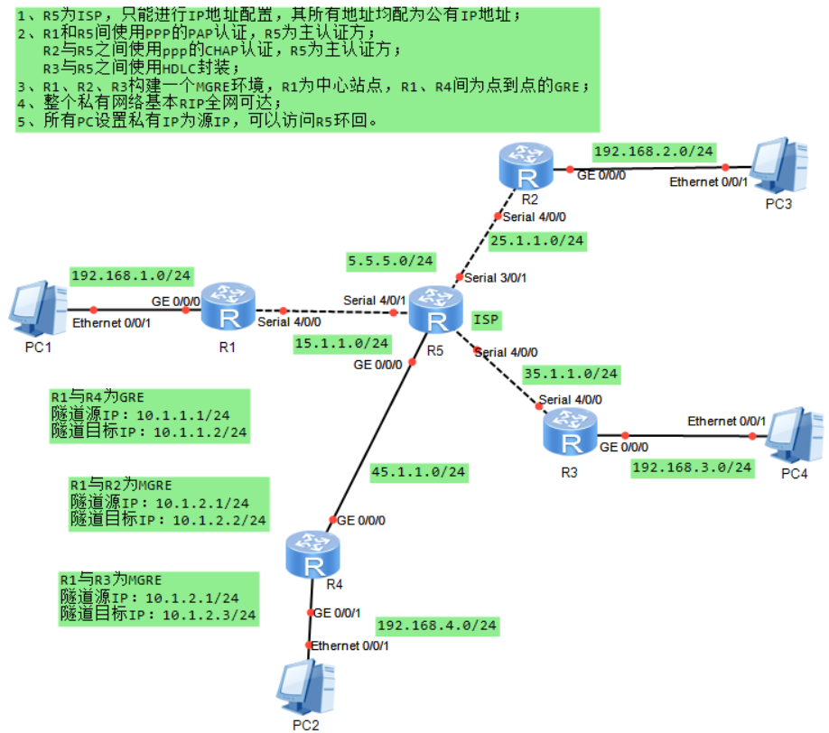
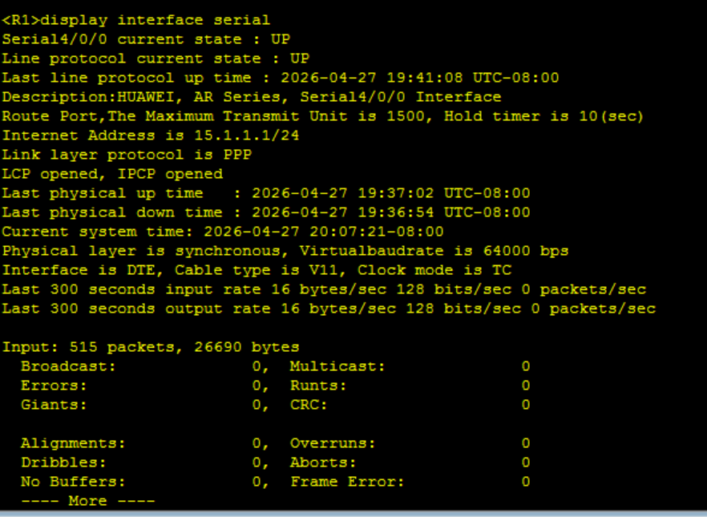
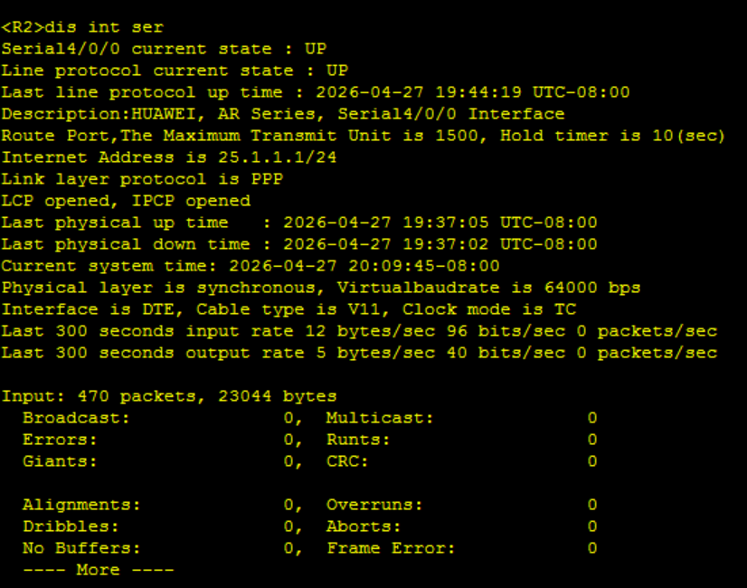
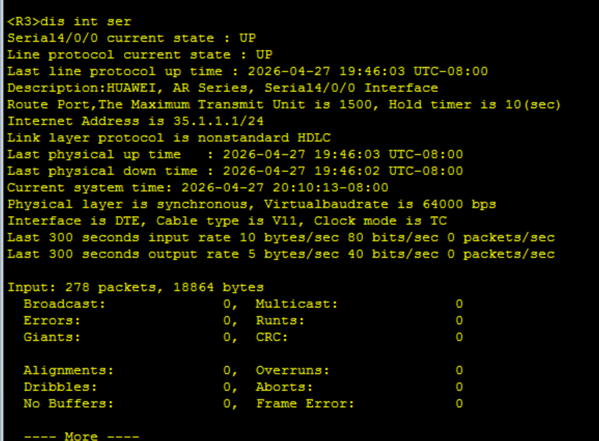
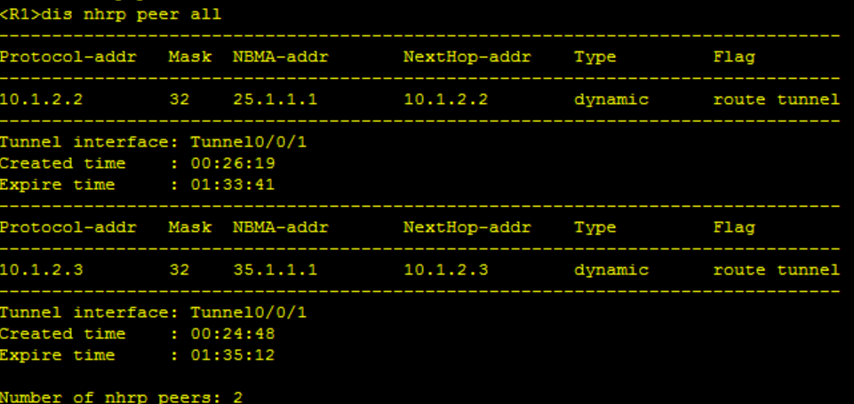
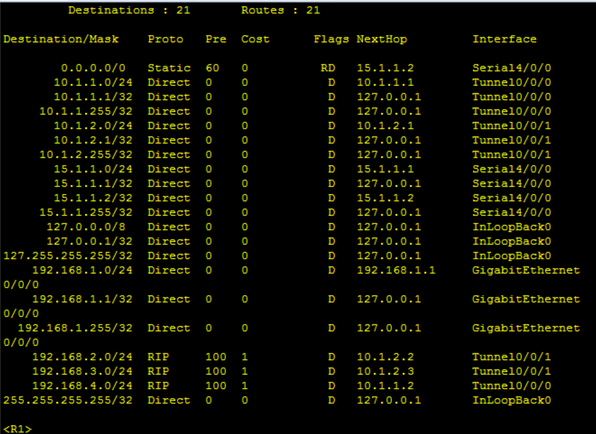
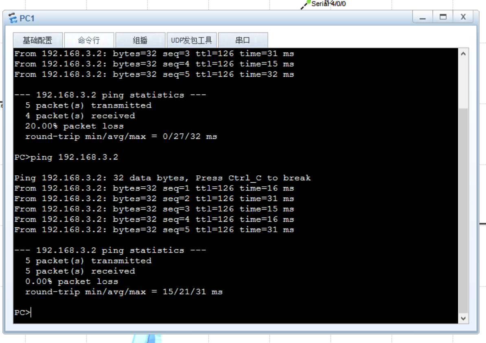
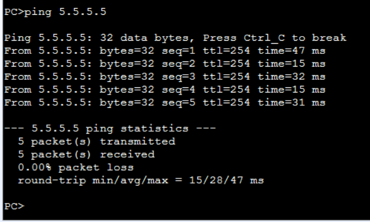

# VPN综合实验报告

## 一、 实验目的

1. 掌握广域网链路层封装协议（PPP、HDLC）的配置与应用。
2. 掌握 PPP 认证机制（PAP 明文认证与 CHAP 挑战握手认证）的配置方法。
3. 理解并掌握通用路由封装（GRE）以及多点 GRE（mGRE）的原理与配置。
4. 掌握在 mGRE 隧道环境下动态路由协议（RIP）的配置及防环机制（水平分割）的调整。
5. 掌握 Easy IP NAT 的配置，实现私网地址访问公网的需求。

## 二、 实验拓扑与要求

### 1. 实验拓扑



### 2. 实验要求

1. R5 为 ISP，只能进行 IP 地址配置，其所有地址均为公有 IP 地址。
2. R1 和 R5 之间使用 PPP 的 PAP 认证，R5 为主认证方；R2 与 R5 之间使用 PPP 的 CHAP 认证，R5 为主认证方；R3 与 R5 之间使用 HDLC 封装。
3. R1、R2、R3 构建一个 mGRE 环境，R1 为中心站点；R1、R4 间为点到点的 GRE。
4. 整个私有网络基本 RIP 全网可达。
5. 所有 PC 设置私有 IP 为源 IP，可以访问 R5 环回。

## 三、 实验步骤与配置

### 1. 底层公网互通与链路层配置

**ISP (R5) 基础与认证端配置：**

```
<ISP> system-view
[ISP] sysname ISP
[ISP] interface LoopBack 0
[ISP-LoopBack0] ip address 5.5.5.5 24
[ISP-LoopBack0] quit
[ISP] interface Serial 4/0/1
[ISP-Serial4/0/1] ip address 15.1.1.2 24
[ISP-Serial4/0/1] quit
[ISP] interface Serial 3/0/1
[ISP-Serial3/0/1] ip address 25.1.1.2 24
[ISP-Serial3/0/1] quit
[ISP] interface Serial 4/0/0
[ISP-Serial4/0/0] ip address 35.1.1.2 24
[ISP-Serial4/0/0] quit
[ISP] interface GigabitEthernet 0/0/0
[ISP-GigabitEthernet0/0/0] ip address 45.1.1.2 24
[ISP-GigabitEthernet0/0/0] quit

# 配置 PAP 与 CHAP 认证
[ISP] aaa
[ISP-aaa] local-user wangdaye password cipher wdy12345
[ISP-aaa] local-user wangdaye service-type ppp
[ISP-aaa] quit
[ISP] interface Serial 4/0/1
[ISP-Serial4/0/1] link-protocol ppp
[ISP-Serial4/0/1] ppp authentication-mode pap
[ISP] interface Serial 3/0/1
[ISP-Serial3/0/1] link-protocol ppp
[ISP-Serial3/0/1] ppp authentication-mode chap

# 配置 HDLC
[ISP] interface Serial 4/0/0
[ISP-Serial4/0/0] link-protocol hdlc
```

**R1：**

```
sys
sysname R1
# 基础 IP 与 PPP 认证
interface Serial 4/0/0
 link-protocol ppp
 ppp pap local-user wangdaye password cipher wdy12345
 ip address 15.1.1.1 24
interface GigabitEthernet 0/0/0
 ip address 192.168.1.1 24

# 缺省路由
ip route-static 0.0.0.0 0 15.1.1.2

# 3.1 点到点 GRE (R1-R4)
interface Tunnel 0/0/0
 ip address 10.1.1.1 24
 tunnel-protocol gre
 source 15.1.1.1
 destination 45.1.1.1

# 3.2 mGRE (R1-R2/R3 中心)
interface Tunnel 0/0/1
 ip address 10.1.2.1 24
 tunnel-protocol gre p2mp
 source Serial 4/0/0
 nhrp network-id 100
 nhrp entry multicast dynamic  # 允许伪广播

# 4. RIP
rip 1
 version 2
 network 192.168.1.0
 network 10.0.0.0
# mGRE 环境下 RIP 需要关闭水平分割
interface Tunnel 0/0/1
 undo rip split-horizon

# 5. NAT
acl 2000
 rule permit source 192.168.1.0 0.0.0.255
interface Serial 4/0/0
 nat outbound 2000
```

##### R2：

```
sys
sysname R2
# 基础 IP 与 CHAP 认证
interface Serial 4/0/0
 link-protocol ppp
 ppp chap user wangdaye
 ppp chap password cipher wdy12345
 ip address 25.1.1.1 24
interface GigabitEthernet 0/0/0
 ip address 192.168.2.1 24

# 缺省路由
ip route-static 0.0.0.0 0 25.1.1.2

# 3. mGRE 分支配置
interface Tunnel 0/0/0
 ip address 10.1.2.2 24
 tunnel-protocol gre p2mp
 source Serial 4/0/0
 nhrp network-id 100
 nhrp entry 10.1.2.1 15.1.1.1 register # 注册到中心

# 4. RIP
rip 1
 version 2
 network 192.168.2.0
 network 10.0.0.0

# 5. NAT
acl 2000
 rule permit source 192.168.2.0 0.0.0.255
interface Serial 4/0/0
 nat outbound 2000
```

##### R3:

```
sys
sysname R3
# 基础 IP 与 HDLC
interface Serial 4/0/0
 link-protocol hdlc
 ip address 35.1.1.1 24
interface GigabitEthernet 0/0/0
 ip address 192.168.3.1 24

# 缺省路由
ip route-static 0.0.0.0 0 35.1.1.2

# 3. mGRE 分支配置
interface Tunnel 0/0/0
 ip address 10.1.2.3 24
 tunnel-protocol gre p2mp
 source Serial 4/0/0
 nhrp network-id 100
 nhrp entry 10.1.2.1 15.1.1.1 register

# 4. RIP
rip 1
 version 2
 network 192.168.3.0
 network 10.0.0.0

# 5. NAT
acl 2000
 rule permit source 192.168.3.0 0.0.0.255
interface Serial 4/0/0
 nat outbound 2000
```

##### R4:

```
sys
sysname R4
# 基础 IP
interface GigabitEthernet 0/0/0
 ip address 45.1.1.1 24
interface GigabitEthernet 0/0/1
 ip address 192.168.4.1 24

# 缺省路由
ip route-static 0.0.0.0 0 45.1.1.2

# 3. 点到点 GRE (R4-R1)
interface Tunnel 0/0/0
 ip address 10.1.1.2 24
 tunnel-protocol gre
 source 45.1.1.1
 destination 15.1.1.1

# 4. RIP
rip 1
 version 2
 network 192.168.4.0
 network 10.0.0.0

# 5. NAT
acl 2000
 rule permit source 192.168.4.0 0.0.0.255
interface GigabitEthernet 0/0/0
 nat outbound 2000
```

## 四、 实验验证

1. **底层链路验证**：在 R1、R2、R3 上使用 `display interface serial` 命令，确认物理层和协议层均显示为 `UP`，LCP 和 IPCP 协商成功。

   

   

2. **NHRP 注册验证**：在 R1 上执行 `display nhrp peer all`，查看到 R2（10.1.2.2）和 R3（10.1.2.3）的公网映射记录，且状态为 `Registered`，证明 mGRE 隧道建立成功。

   

3. **路由表验证**：在私网路由器上执行 `display ip routing-table`，确认能够学习到全网的 `192.168.x.0/24` 路由条目。

4. **连通性测试**：

   - 内部互访：使用 PC1 能够成功 Ping 通 PC2、PC3 和 PC4 的私网地址。

     

   - 公网访问：使用各 PC Ping 测 ISP 环回地址 `5.5.5.5`，通信正常

     

## 五、 实验总结与排错心得

本次实验综合性较强，涵盖了从数据链路层到网络层的多项关键技术。在实验过程中总结出以下关键点：

1. **路由宣告的边界**：在配置 RIP 时，必须严格区分公网和私网边界，仅宣告私网网段和隧道网段，绝不能将物理公网接口宣告进内部协议中。
2. **水平分割问题**：在 Hub-Spoke 架构的 mGRE 环境中，由于多个分支共用中心节点的一个 Tunnel 接口，中心节点从该接口收到的 RIP 路由默认不会再从该接口发回给其他分支。因此，必须在中心站点的 Tunnel 接口上执行 `undo rip split-horizon`，否则分支之间无法相互学习路由。