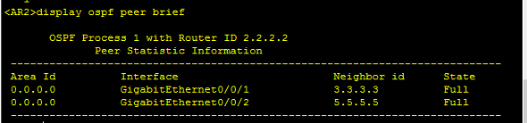
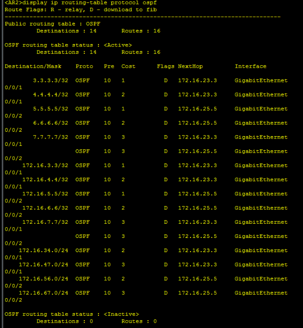
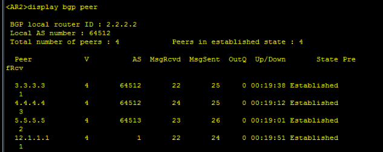
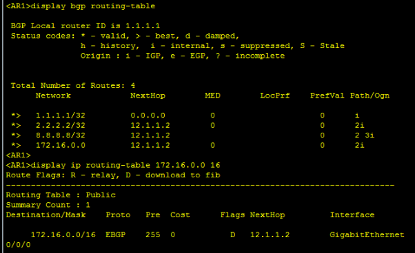
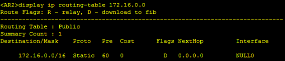
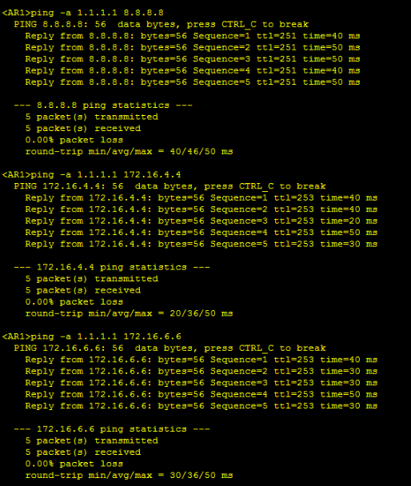
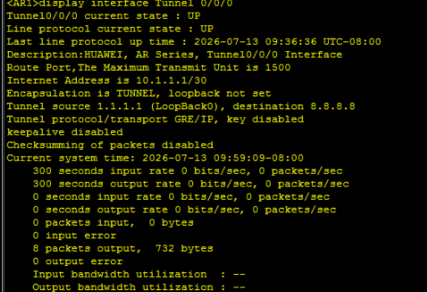
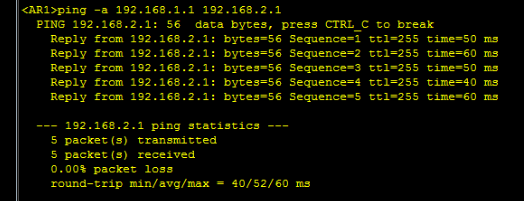
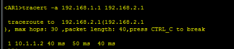

# BGP综合实验报告

## 一、 实验要求

1. AS1中存在两个环回，一个地址为192.168.1.0/24，该地址不能在任何协议中宣告； AS3中存在两个环回，一个地址为192.168.2.0/24，该地址不能在任何协议中宣告，最终要求这两个环回可以ping通；
2. 2.整个AS2的IP地址为172.16.0.0/16，请合理划分；并且其内部配置OSPF协议
3. R1-R8的建邻环回用x.x.x.x/32表示；R3-R7上再划分一个业务网段；
4. AS间的骨干链路IP地址随意定制；
5. 使用BGP协议让整个网络所有设备的环回可以互相访问；
6. 减少路由条目数量，避免环路出现；

## 二、 IP地址及网段规划

*   **AS间骨干链路**：AR1-AR2 (12.1.1.0/24), AR7-AR8 (34.1.1.0/24)
*   **建邻Loopback 0**：1.1.1.1/32 - 8.8.8.8/32
*   **AS2内部链路 (172.16.0.0/16)**：
    *   AR2-AR3: 172.16.23.0/24
    *   AR3-AR4: 172.16.34.0/24
    *   AR2-AR5: 172.16.25.0/24
    *   AR5-AR6: 172.16.56.0/24
    *   AR6-AR7: 172.16.67.0/24
    *   AR4-AR7: 172.16.47.0/24
*   **业务Loopback 1 **：172.16.3.3/24, 172.16.4.4/24, 172.16.5.5/24, 172.16.6.6/24, 172.16.7.7/24
*   **隔离网络**：AR1 (192.168.1.1/24), AR8 (192.168.2.1/24)
*   **GRE Tunnel网段**：10.1.1.0/30

## 三、 设备配置

### AR1 配置
```text
sysname AR1

interface GigabitEthernet0/0/0
 ip address 12.1.1.1 24

interface LoopBack0
 ip address 1.1.1.1 32

interface LoopBack2
 ip address 192.168.1.1 24

interface Tunnel0/0/0
 ip address 10.1.1.1 255.255.255.252
 tunnel-protocol gre
 source 1.1.1.1
 destination 8.8.8.8

bgp 1
 router-id 1.1.1.1
 peer 12.1.1.2 as-number 2
 
 ipv4-family unicast
  network 1.1.1.1 32

ip route-static 192.168.2.0 255.255.255.0 Tunnel0/0/0
```

### AR2 配置
```text
sysname AR2

interface GigabitEthernet0/0/0
 ip address 12.1.1.2 24

interface GigabitEthernet0/0/1
 ip address 172.16.23.2 24

interface GigabitEthernet0/0/2
 ip address 172.16.25.2 24

interface LoopBack0
 ip address 2.2.2.2 32

ospf 1 router-id 2.2.2.2
 area 0.0.0.0
  network 2.2.2.2 0.0.0.0
  network 172.16.23.0 0.0.0.255
  network 172.16.25.0 0.0.0.255

ip route-static 172.16.0.0 255.255.0.0 NULL 0

bgp 64512
 router-id 2.2.2.2
 confederation id 2
 confederation peer-as 64513
 peer 12.1.1.1 as-number 1
 peer 3.3.3.3 as-number 64512
 peer 3.3.3.3 connect-interface LoopBack0
 peer 4.4.4.4 as-number 64512
 peer 4.4.4.4 connect-interface LoopBack0
 peer 5.5.5.5 as-number 64513
 peer 5.5.5.5 connect-interface LoopBack0
 peer 5.5.5.5 ebgp-max-hop 2
 
 ipv4-family unicast
  peer 3.3.3.3 next-hop-local
  peer 4.4.4.4 next-hop-local
  peer 5.5.5.5 next-hop-local
  network 2.2.2.2 32
  network 172.16.0.0 255.255.0.0
```

### AR3 配置
```text
sysname AR3

interface GigabitEthernet0/0/0
 ip address 172.16.23.3 24

interface GigabitEthernet0/0/1
 ip address 172.16.34.3 24

interface LoopBack0
 ip address 3.3.3.3 32

interface LoopBack1
 ip address 172.16.3.3 24

ospf 1 router-id 3.3.3.3
 area 0.0.0.0
  network 3.3.3.3 0.0.0.0
  network 172.16.3.0 0.0.0.255
  network 172.16.23.0 0.0.0.255
  network 172.16.34.0 0.0.0.255

bgp 64512
 router-id 3.3.3.3
 confederation id 2
 peer 2.2.2.2 as-number 64512
 peer 2.2.2.2 connect-interface LoopBack0
 peer 4.4.4.4 as-number 64512
 peer 4.4.4.4 connect-interface LoopBack0
 
 ipv4-family unicast
  network 3.3.3.3 32
```

### AR4 配置
```text
sysname AR4

interface GigabitEthernet0/0/0
 ip address 172.16.34.4 24

interface GigabitEthernet0/0/1
 ip address 172.16.47.4 24

interface LoopBack0
 ip address 4.4.4.4 32

interface LoopBack1
 ip address 172.16.4.4 24

ospf 1 router-id 4.4.4.4
 area 0.0.0.0
  network 4.4.4.4 0.0.0.0
  network 172.16.4.0 0.0.0.255
  network 172.16.34.0 0.0.0.255
  network 172.16.47.0 0.0.0.255

bgp 64512
 router-id 4.4.4.4
 confederation id 2
 confederation peer-as 64513
 peer 2.2.2.2 as-number 64512
 peer 2.2.2.2 connect-interface LoopBack0
 peer 3.3.3.3 as-number 64512
 peer 3.3.3.3 connect-interface LoopBack0
 peer 7.7.7.7 as-number 64513
 peer 7.7.7.7 connect-interface LoopBack0
 peer 7.7.7.7 ebgp-max-hop 2
 
 ipv4-family unicast
  network 4.4.4.4 32
```

### AR5 配置
```text
sysname AR5

interface GigabitEthernet0/0/0
 ip address 172.16.25.5 24

interface GigabitEthernet0/0/1
 ip address 172.16.56.5 24

interface LoopBack0
 ip address 5.5.5.5 32

interface LoopBack1
 ip address 172.16.5.5 24

ospf 1 router-id 5.5.5.5
 area 0.0.0.0
  network 5.5.5.5 0.0.0.0
  network 172.16.5.0 0.0.0.255
  network 172.16.25.0 0.0.0.255
  network 172.16.56.0 0.0.0.255

bgp 64513
 router-id 5.5.5.5
 confederation id 2
 confederation peer-as 64512
 peer 2.2.2.2 as-number 64512
 peer 2.2.2.2 connect-interface LoopBack0
 peer 2.2.2.2 ebgp-max-hop 2
 peer 6.6.6.6 as-number 64513
 peer 6.6.6.6 connect-interface LoopBack0
 peer 7.7.7.7 as-number 64513
 peer 7.7.7.7 connect-interface LoopBack0
 
 ipv4-family unicast
  network 5.5.5.5 32
```

### AR6 配置
```text
sysname AR6

interface GigabitEthernet0/0/0
 ip address 172.16.56.6 24

interface GigabitEthernet0/0/1
 ip address 172.16.67.6 24

interface LoopBack0
 ip address 6.6.6.6 32

interface LoopBack1
 ip address 172.16.6.6 24

ospf 1 router-id 6.6.6.6
 area 0.0.0.0
  network 6.6.6.6 0.0.0.0
  network 172.16.6.0 0.0.0.255
  network 172.16.56.0 0.0.0.255
  network 172.16.67.0 0.0.0.255

bgp 64513
 router-id 6.6.6.6
 confederation id 2
 peer 5.5.5.5 as-number 64513
 peer 5.5.5.5 connect-interface LoopBack0
 peer 7.7.7.7 as-number 64513
 peer 7.7.7.7 connect-interface LoopBack0
 
 ipv4-family unicast
  network 6.6.6.6 32
```

### AR7 配置
```text
sysname AR7

interface GigabitEthernet0/0/0
 ip address 172.16.67.7 24

interface GigabitEthernet0/0/1
 ip address 172.16.47.7 24

interface GigabitEthernet0/0/2
 ip address 34.1.1.7 24

interface LoopBack0
 ip address 7.7.7.7 32

interface LoopBack1
 ip address 172.16.7.7 24

ospf 1 router-id 7.7.7.7
 area 0.0.0.0
  network 7.7.7.7 0.0.0.0
  network 172.16.7.0 0.0.0.255
  network 172.16.67.0 0.0.0.255
  network 172.16.47.0 0.0.0.255

ip route-static 172.16.0.0 255.255.0.0 NULL 0

bgp 64513
 router-id 7.7.7.7
 confederation id 2
 confederation peer-as 64512
 peer 34.1.1.8 as-number 3
 peer 4.4.4.4 as-number 64512
 peer 4.4.4.4 connect-interface LoopBack0
 peer 4.4.4.4 ebgp-max-hop 2
 peer 5.5.5.5 as-number 64513
 peer 5.5.5.5 connect-interface LoopBack0
 peer 6.6.6.6 as-number 64513
 peer 6.6.6.6 connect-interface LoopBack0
 
 ipv4-family unicast
  peer 4.4.4.4 next-hop-local
  peer 5.5.5.5 next-hop-local
  peer 6.6.6.6 next-hop-local
  network 7.7.7.7 32
  network 172.16.0.0 255.255.0.0
```

### AR8 配置
```text
sysname AR8

interface GigabitEthernet0/0/0
 ip address 34.1.1.8 24

interface LoopBack0
 ip address 8.8.8.8 32

interface LoopBack2
 ip address 192.168.2.1 24

interface Tunnel0/0/0
 ip address 10.1.1.2 255.255.255.252
 tunnel-protocol gre
 source 8.8.8.8
 destination 1.1.1.1

bgp 3
 router-id 8.8.8.8
 peer 34.1.1.7 as-number 2
 
 ipv4-family unicast
  network 8.8.8.8 32

ip route-static 192.168.1.0 255.255.255.0 Tunnel0/0/0
```

## 四、实验验证

### 一、 IGP

验证AS2内部（AR2至AR7）的OSPF是否正常建立，底层路由是否完全收敛。

- **检查OSPF邻居状态**：在AR2、AR3、AR4、AR5、AR6、AR7上执行以下命令

  ```
  display ospf peer brief
  ```

  **结果**：

- **检查底层路由**：在AR2或AR7上查看OSPF路由表。

  Plaintext

  ```
  display ip routing-table protocol ospf
  ```

  **结果**：

### 二、 BGP 邻居与联邦状态验证

- **检查BGP对等体状态**：在任意路由器（以AR2为例）执行以下命令

  ```
  display bgp peer
  ```

  **结果**：

### 三、 路由聚合与防环机制验证

- **验证路由精简**：在边界路由器 AR1 和 AR8 上检查BGP路由表

  ```
  display bgp routing-table
  display ip routing-table 172.16.0.0 16
  ```

  **结果**：

- **验证黑洞防环**：在聚合路由器 AR2 和 AR7 上检查。

  ```
  display ip routing-table 172.16.0.0
  ```

  **结果**：

### 四、 骨干网端到端连通性验证

- **全网Loopback互Ping测试**：在AR1上带源地址Ping AR8的环回口，以及AS2内部的业务环回口。

  ```
  ping -a 1.1.1.1 8.8.8.8
  ping -a 1.1.1.1 172.16.4.4
  ping -a 1.1.1.1 172.16.6.6
  ```

  **结果**：

### 五、 GRE Tunnel 隔离网段透传验证

- **隧道接口状态**：在AR1上检查Tunnel接口

  ```
  display interface Tunnel 0/0/0
  ```

  **结果**：

- **隔离网段业务Ping测试**：在AR1上模拟内网终端发起测试。

  ```
  ping -a 192.168.1.1 192.168.2.1
  ```

  **结果**：

- **隧道引流路径验证**：在AR1上执行路由追踪。

  ```
  tracert -a 192.168.1.1 192.168.2.1
  ```

  **结果**：
