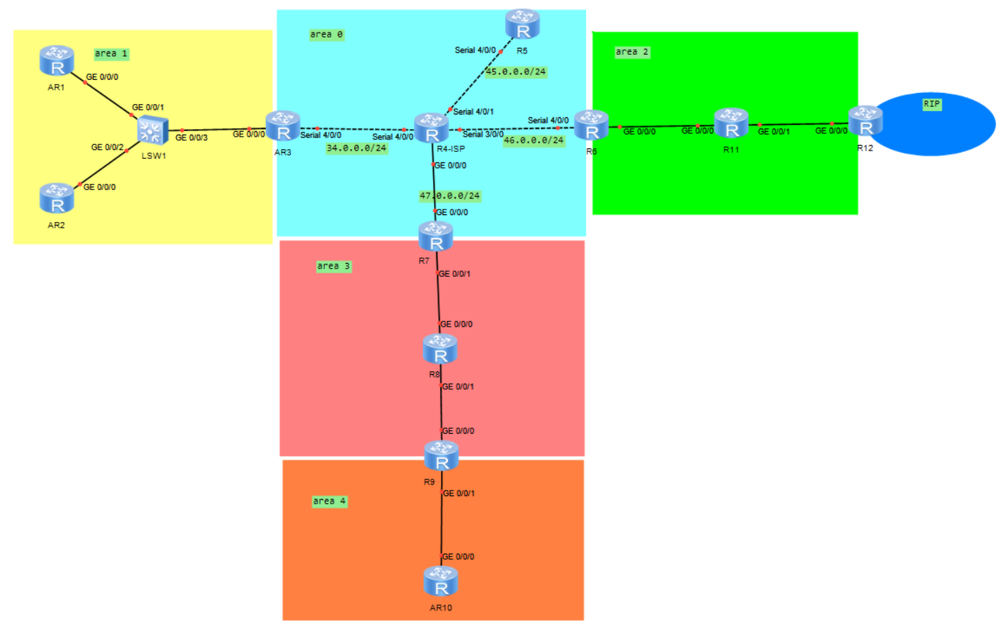
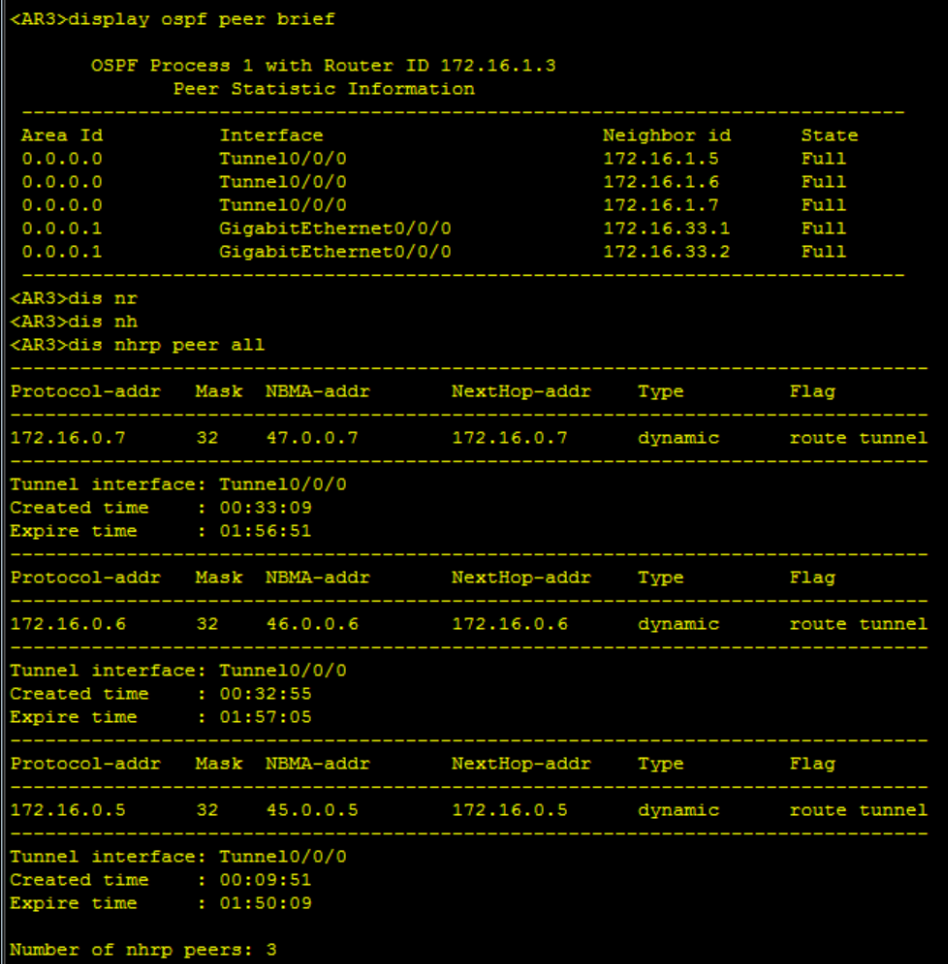
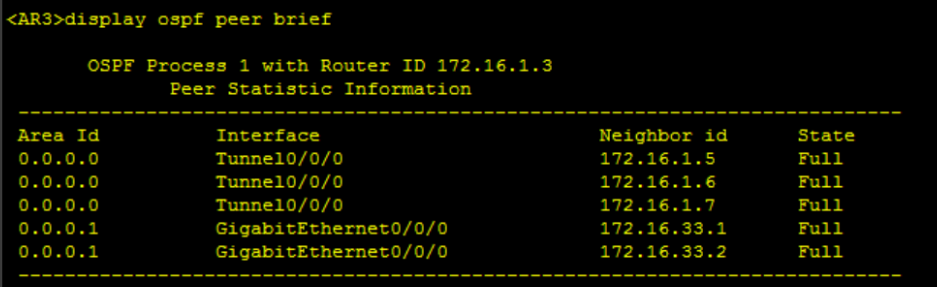
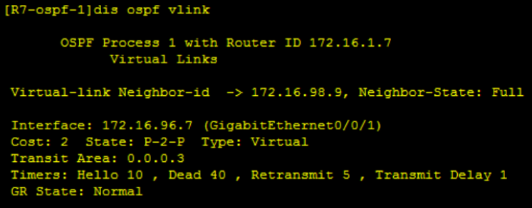
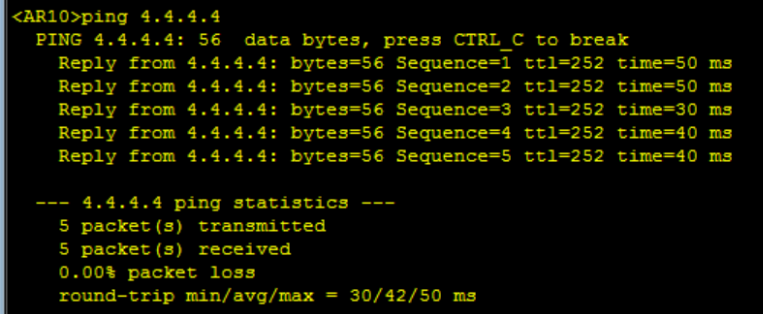
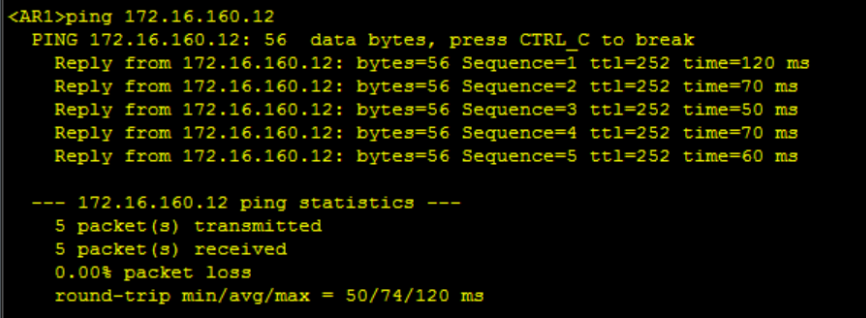

# OSPF综合实验报告

## 一、 实验目的

1. 熟练配置中心到分支架构的MGRE环境。
2. 掌握 OSPF 多区域设计，包括骨干区域与非骨干区域的交互，以及非法拓扑下虚链路的部署。
3. 通过配置特殊区域（Stub、NSSA）与 ABR 路由汇总，精简路由表，降低设备资源消耗，加快网络收敛。
4. 实现 OSPF 与 RIP 路由协议的双向重发布。
5. 利用 NAT实现私网跨越公网通信。

## 二、 实验拓扑与需求

### 1. 需求

1、R4为ISP，其上只配置IP地址；R4与其他所直连设备间均使用公有IP；

2、R3-R5、R6、R7为MGRE环境，R3为中心站点；

3、整个OSPF环境IP基于172.16.0.0/16划分；除了R12有两个环回，其他路由器均有一个环回IP

4、所有设备均可访问R4的环回；

5、减少LSA的更新量，加快收敛，保障更新安全；

6、全网可达；

### 2. 实验拓扑：



## 三、 IP 地址规划表

| **网络区域** | **地址块分配**              | **包含节点/接口说明**               | **汇总路由**      |
| ------------ | --------------------------- | ----------------------------------- | ----------------- |
| **公网 ISP** | `34.x / 45.x / 46.x / 47.x` | R4 与边界设备的直连链路             |                   |
| **Area 0**   | `172.16.0.0/19`             | MGRE 私网隧道、R3/R5/R6/R7 骨干环回 | 不汇总            |
| **Area 1**   | `172.16.32.0/19`            | AR1、AR2、AR3(内部接口) 及对应环回  | `172.16.32.0/19`  |
| **Area 2**   | `172.16.64.0/19`            | R6、R11、R12(OSPF侧) 互联及环回     | `172.16.64.0/19`  |
| **Area 3**   | `172.16.96.0/19`            | R7、R8、R9(内部接口) 互联及环回     | `172.16.96.0/19`  |
| **Area 4**   | `172.16.128.0/19`           | R9、AR10 互联及对应环回             | `172.16.128.0/19` |
| **RIP 域**   | `172.16.160.0/19`           | R12 的远端环回口                    | `172.16.160.0/19` |

## 四、 配置

### 1. 公网 ISP 设备

```
sysname R4
interface LoopBack0
 ip address 4.4.4.4 24
interface Serial4/0/0
 ip address 34.0.0.4 24
interface Serial4/0/1
 ip address 45.0.0.4 24
interface Serial3/0/0
 ip address 46.0.0.4 24
interface GigabitEthernet0/0/0
 ip address 47.0.0.4 24
quit
```

### 2. Area 1 区域设备 (Stub)

```
sysname AR1
interface GigabitEthernet0/0/0
 ip address 172.16.32.1 24
interface LoopBack0
 ip address 172.16.33.1 24
quit
ospf 1 router-id 172.16.33.1
 area 1
  network 172.16.32.1 0.0.0.0
  network 172.16.33.1 0.0.0.0
  stub

sysname AR2
interface GigabitEthernet0/0/0
 ip address 172.16.32.2 24
interface LoopBack0
 ip address 172.16.33.2 24
quit
ospf 1 router-id 172.16.33.2
 area 1
  network 172.16.32.2 0.0.0.0
  network 172.16.33.2 0.0.0.0
  stub

sysname AR3
interface GigabitEthernet0/0/0
 ip address 172.16.32.3 24
interface Serial4/0/0
 ip address 34.0.0.3 24
interface LoopBack0
 ip address 172.16.1.3 24
quit
ip route-static 0.0.0.0 0 34.0.0.4
acl 2000
 rule permit source 172.16.0.0 0.0.255.255
quit
interface Serial4/0/0
 nat outbound 2000
quit
interface Tunnel0/0/0
 ip address 172.16.0.3 24
 tunnel-protocol gre p2mp
 source Serial4/0/0
 nhrp network-id 100
 nhrp entry multicast dynamic
 ospf network-type broadcast
 ospf timer hello 5
quit
ospf 1 router-id 172.16.1.3
 default-route-advertise always
 area 0
  network 172.16.0.3 0.0.0.0
  network 172.16.1.3 0.0.0.0
 area 1
  network 172.16.32.3 0.0.0.0
  abr-summary 172.16.32.0 255.255.224.0
  stub no-summary
```

### 3. Area 0 & Area 2 区域设备 (MGRE&NSSA)

```
sysname R5
interface Serial4/0/0
 ip address 45.0.0.5 24
interface LoopBack0
 ip address 172.16.1.5 24
quit
ip route-static 0.0.0.0 0 45.0.0.4
acl 2000
 rule permit source 172.16.0.0 0.0.255.255
quit
interface Serial4/0/1
 nat outbound 2000
quit
interface Tunnel0/0/0
 ip address 172.16.0.5 24
 tunnel-protocol gre p2mp
 source Serial4/0/1
 nhrp network-id 100
 nhrp entry 172.16.0.3 34.0.0.3 register
 ospf network-type broadcast
 ospf dr-priority 0
 ospf timer hello 5
quit
ospf 1 router-id 172.16.1.5
 default-route-advertise always
 area 0
  network 172.16.0.5 0.0.0.0
  network 172.16.1.5 0.0.0.0

sysname R6
interface Serial4/0/0
 ip address 46.0.0.6 24
interface GigabitEthernet0/0/0
 ip address 172.16.64.6 24
interface LoopBack0
 ip address 172.16.1.6 24
quit
ip route-static 0.0.0.0 0 46.0.0.4
acl 2000
 rule permit source 172.16.0.0 0.0.255.255
quit
interface Serial4/0/0
 nat outbound 2000
quit
interface Tunnel0/0/0
 ip address 172.16.0.6 24
 tunnel-protocol gre p2mp
 source Serial4/0/0
 nhrp network-id 100
 nhrp entry 172.16.0.3 34.0.0.3 register
 ospf network-type broadcast
 ospf dr-priority 0
 ospf timer hello 5
quit
ospf 1 router-id 172.16.1.6
 default-route-advertise always
 area 0
  network 172.16.0.6 0.0.0.0
  network 172.16.1.6 0.0.0.0
 area 2
  network 172.16.64.6 0.0.0.0
  abr-summary 172.16.64.0 255.255.224.0
  nssa no-summary

sysname R11
interface GigabitEthernet0/0/0
 ip address 172.16.64.11 24
interface GigabitEthernet0/0/1
 ip address 172.16.65.11 24
interface LoopBack0
 ip address 172.16.66.11 24
quit
ospf 1 router-id 172.16.66.11
 area 2
  network 172.16.64.11 0.0.0.0
  network 172.16.65.11 0.0.0.0
  network 172.16.66.11 0.0.0.0
  nssa

sysname R12
interface GigabitEthernet0/0/0
 ip address 172.16.65.12 24
interface LoopBack0
 ip address 172.16.66.12 24
interface LoopBack1
 ip address 172.16.160.12 24
quit
rip 1
 version 2
 undo summary
 network 172.16.0.0
 import-route ospf 1
quit
ospf 1 router-id 172.16.66.12
 asbr-summary 172.16.160.0 255.255.224.0
 import-route rip 1
 area 2
  network 172.16.65.12 0.0.0.0
  network 172.16.66.12 0.0.0.0
  nssa
```

### 4. Area 3 & Area 4 区域设备 (Vlink&Stub)

```
sysname R7
interface GigabitEthernet0/0/0
 ip address 47.0.0.7 24
interface GigabitEthernet0/0/1
 ip address 172.16.96.7 24
interface LoopBack0
 ip address 172.16.1.7 24
quit
ip route-static 0.0.0.0 0 47.0.0.4
acl 2000
 rule permit source 172.16.0.0 0.0.255.255
quit
interface GigabitEthernet0/0/0
 nat outbound 2000
quit
interface Tunnel0/0/0
 ip address 172.16.0.7 24
 tunnel-protocol gre p2mp
 source GigabitEthernet0/0/0
 nhrp network-id 100
 nhrp entry 172.16.0.3 34.0.0.3 register
 ospf network-type broadcast
 ospf dr-priority 0
 ospf timer hello 5
quit
ospf 1 router-id 172.16.1.7
 default-route-advertise always
 area 0
  network 172.16.0.7 0.0.0.0
  network 172.16.1.7 0.0.0.0
 area 3
  network 172.16.96.7 0.0.0.0
  abr-summary 172.16.96.0 255.255.224.0
  vlink-peer 172.16.98.9

sysname R8
interface GigabitEthernet0/0/0
 ip address 172.16.96.8 24
interface GigabitEthernet0/0/1
 ip address 172.16.97.8 24
interface LoopBack0
 ip address 172.16.98.8 24
quit
ospf 1 router-id 172.16.98.8
 area 3
  network 172.16.96.8 0.0.0.0
  network 172.16.97.8 0.0.0.0
  network 172.16.98.8 0.0.0.0

sysname R9
interface GigabitEthernet0/0/0
 ip address 172.16.97.9 24
interface GigabitEthernet0/0/1
 ip address 172.16.128.9 24
interface LoopBack0
 ip address 172.16.98.9 24
quit
ospf 1 router-id 172.16.98.9
 area 3
  network 172.16.97.9 0.0.0.0
  network 172.16.98.9 0.0.0.0
  vlink-peer 172.16.1.7
 area 4
  network 172.16.128.9 0.0.0.0
  abr-summary 172.16.128.0 255.255.224.0
  stub no-summary

sysname AR10
interface GigabitEthernet0/0/0
 ip address 172.16.128.10 24
interface LoopBack0
 ip address 172.16.129.10 24
quit
ospf 1 router-id 172.16.129.10
 area 4
  network 172.16.128.10 0.0.0.0
  network 172.16.129.10 0.0.0.0
  stub
save
```

## 五、 实验验证与测试项目

1. **验证 MGRE 隧道与 OSPF 邻居状态：**

   - 在中心节点 R3 执行：`display nhrp peer all` 

     

   - 在 R3 执行：`display ospf peer brief` 

     

2. **验证虚链路连通性：**

   - 在 R7 或 R9 执行：`display ospf vlink` 

     

3. **验证公网通信：**

   - 在边缘末端设备（如 AR10 或 R11）执行：`ping 4.4.4.4` 

     

5. **验证多协议互通：**

   - 在 AR1 执行：`ping 172.16.160.12` 
   
     