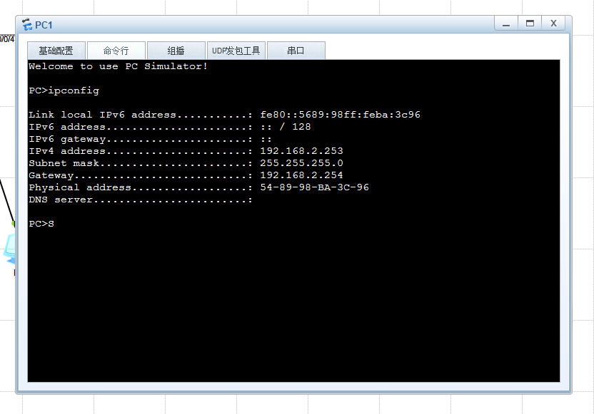
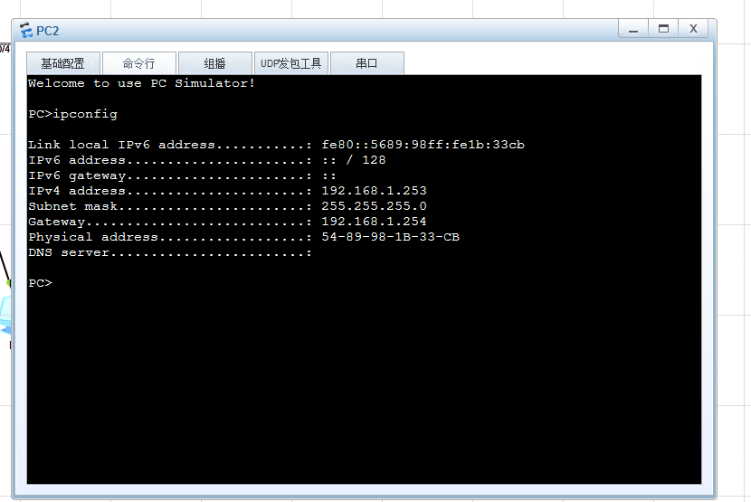
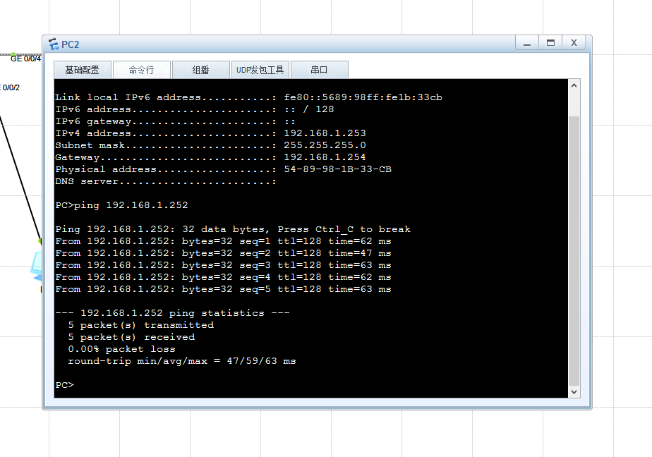
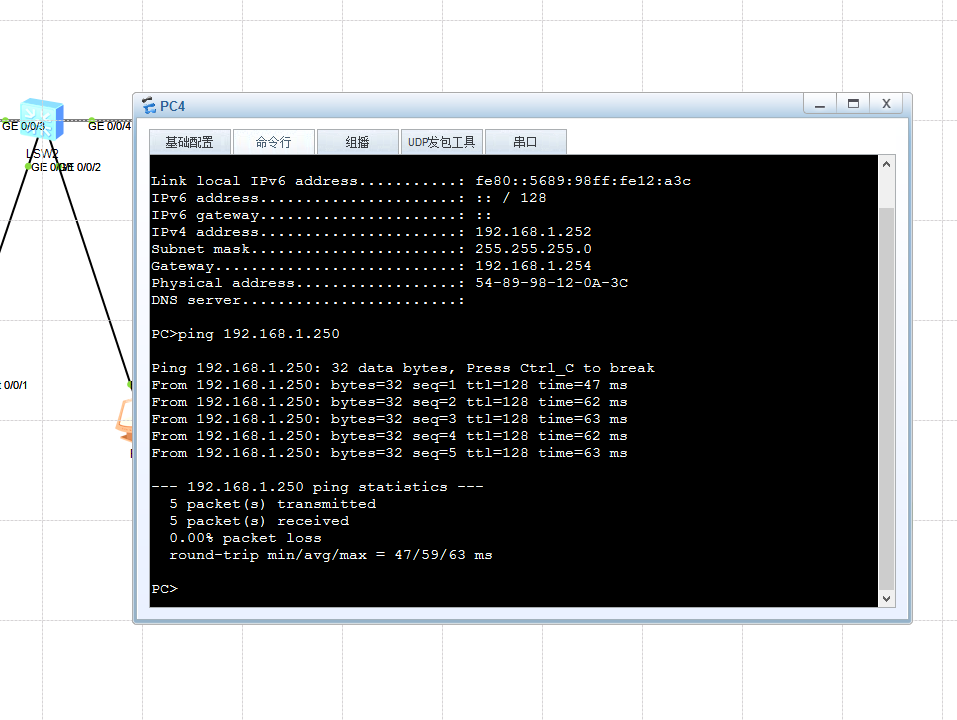
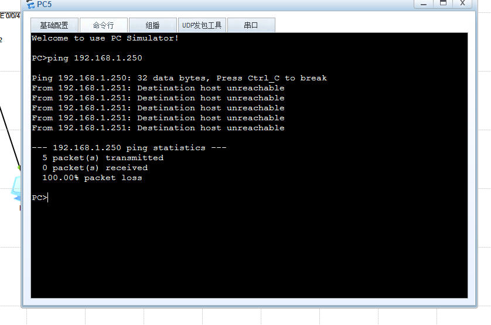
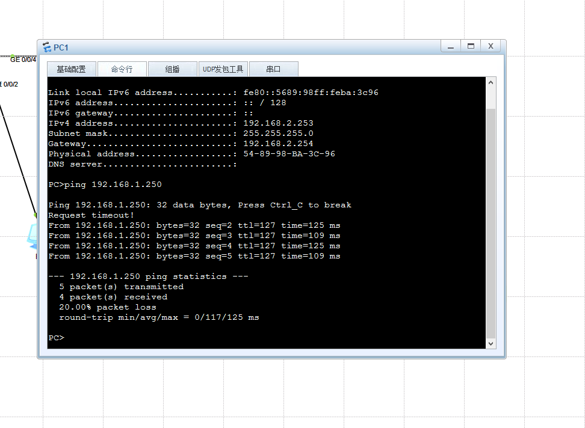
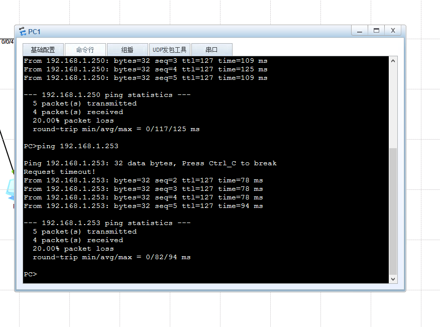

# 综合VLAN与DHCP实验报告

## 一、 实验要求

1、PC1和PC3所在接口为access，属于vlan 2；PC2/PC4/PC5/PC6处于同一网段，其中PC2可以访问
PC4/PC5/PC6；PC4可以访问PC6；PC5不能访问PC6；
2、PC1/PC3与PC2/PC4/PC5/PC6不在同一网段；
3、所有PC通过DHCP获取IP地址，且PC1/PC3可以正常访问PC2/PC4/PC5/PC6。

## 二、 IP地址及网段规划

VLAN 2 网段：192.168.2.0/24 (PC1, PC3使用)
VLAN 3/4/5/6 网段：192.168.1.0/24 (PC2, PC4, PC5, PC6使用同一网段)
网关及DHCP服务器 (R1)：
GE 0/0/0.2 (终结VLAN 2)：192.168.2.254/24，作为VLAN 2网关。
GE 0/0/0 (物理主接口)：192.168.1.254/24，作为VLAN 3/4/5/6网关，处理Untagged流量。
终端接入与VLAN隔离策略：
PC2 (VLAN 3)：Hybrid接入，PVID 3，放通 3/4/5/6。
PC4 (VLAN 4)：Hybrid接入，PVID 4，放通 3/4/5/6。
PC5 (VLAN 5)：Hybrid接入，PVID 5，放通 3/4/5 (不放通6，实现与PC6隔离)。
PC6 (VLAN 6)：Hybrid接入，PVID 6，放通 3/4/6 (不放通5，实现与PC5隔离)。

## 三、 设备配置

### R1 配置

```
system-view
sysname R1
dhcp enable
ip pool vlan2
network 192.168.2.0 mask 255.255.255.0
gateway-list 192.168.2.254
quit
ip pool vlan3456
network 192.168.1.0 mask 255.255.255.0
gateway-list 192.168.1.254
quit
interface GigabitEthernet0/0/0
ip address 192.168.1.254 255.255.255.0
dhcp select global
quit
interface GigabitEthernet0/0/0.2
dot1q termination vid 2
ip address 192.168.2.254 255.255.255.0
arp broadcast enable
dhcp select global
quit
```


### LSW1 配置

```
system-view
sysname LSW1
vlan batch 2 3 4 5 6
interface GigabitEthernet0/0/1
port link-type access
port default vlan 2
quit
interface GigabitEthernet0/0/2
port link-type hybrid
port hybrid pvid vlan 3
port hybrid untagged vlan 3 4 5 6
quit
interface GigabitEthernet0/0/3
port link-type trunk
port trunk allow-pass vlan 2 3 4 5 6
quit
interface GigabitEthernet0/0/4
port link-type hybrid
port hybrid pvid vlan 3
port hybrid tagged vlan 2
port hybrid untagged vlan 3 4 5 6
quit
```


### LSW2 配置

```
system-view
sysname LSW2
vlan batch 2 3 4 5 6
interface GigabitEthernet0/0/1
port link-type access
port default vlan 2
quit
interface GigabitEthernet0/0/2
port link-type hybrid
port hybrid pvid vlan 4
port hybrid untagged vlan 3 4 5 6
quit
interface GigabitEthernet0/0/3
port link-type trunk
port trunk allow-pass vlan 2 3 4 5 6
quit
interface GigabitEthernet0/0/4
port link-type trunk
port trunk allow-pass vlan 2 3 4 5 6
quit
```


### LSW3 配置

```
system-view
sysname LSW3
vlan batch 2 3 4 5 6
interface GigabitEthernet0/0/1
port link-type hybrid
port hybrid pvid vlan 5
port hybrid untagged vlan 3 4 5
quit
interface GigabitEthernet0/0/2
port link-type hybrid
port hybrid pvid vlan 6
port hybrid untagged vlan 3 4 6
quit
interface GigabitEthernet0/0/3
port link-type trunk
port trunk allow-pass vlan 2 3 4 5 6
quit
```


## 四、 实验验证

### 一、 DHCP 地址获取验证

测试方法：在PC1~PC6的命令行界面输入 ipconfig 命令，验证是否成功获取到对应网段的IP地址。
预期结果：PC1、PC3获取到 192.168.2.x 地址；PC2、PC4、PC5、PC6获取到 192.168.1.x 地址。




### 二、 同网段终端隔离与互访验证

测试方法：利用 ping 命令在相同网段（192.168.1.0/24）的PC间进行连通性测试，验证Hybrid端口的
Untagged规则是否生效。
在PC2上执行：ping [PC4_IP]
在PC4上执行：ping [PC6_IP]
在PC5上执行：ping [PC6_IP]
预期结果：除了PC5无法Ping通PC6之外，其余连通性测试均正常回复

### 三、 跨网段路由互通验证

测试方法：在VLAN 2的终端上尝试访问VLAN 3/4/5/6的终端，验证R1路由器子接口及主接口的路由转发
能力。
执行命令：在PC1上执行 ping [PC2_IP] 和 ping [PC6_IP]
预期结果：均能正常ping通，说明跨网段通信正常，核心路由及ARP广播配置生效。

•