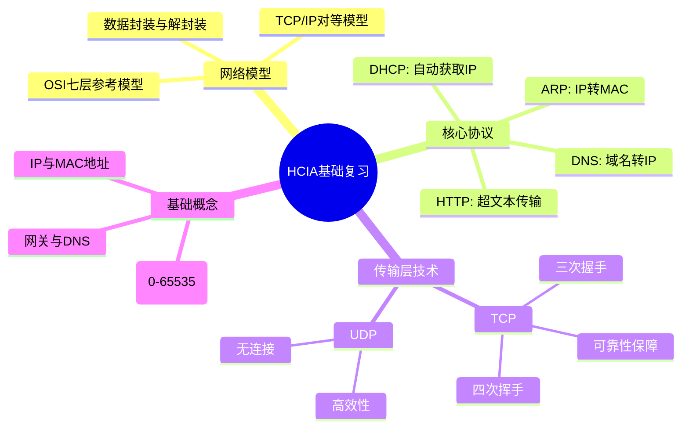

# **一、情景再现：**

ISP网络为学校提供了DNS服务，所以，DNS服务器驻留在ISP网络内，而不再学校网络内。DHCP服务器运行在学校的路由器上。

小明拿了一台电脑，通过网线，接入到校园网内部。其目的是为了访问谷歌网站，即谷歌的web服务器

# **二、访问谷歌（百度）服务器前的准备工作——计算机对人类语言的加工**

## **1、计算机网络发展第一阶段人机交互的过程：**

应用层：把人类语言用计算机编码表示

表示层：编码转换成二进制

介质访问控制层：将二进制转变成电信号

物理层：传输电信号

## **2、OSI参考模型**

### **（1）每层作用：**

**应用层**：为应用程序提供网络服务

**表示层：**定义数据格式；对数据进行加密、解密、编码、解码、压缩解压缩等

**会话层：**对通信双方间的会话，进行建立、维护、拆除

**传输层：**建立端到端的连接（逻辑连接）----端口号

端口号取值范围：0 - 65535（0一般不作为传输层的端口号）

知名端口号：1 - 1023   主要用于标定特定的服务

动态端口号：1024-65535，用于一些不固定的分配给某个服务

域名系统 (DNS)— TCP/UDP 端口 53​

超文本传输协议 (HTTP) — TCP 端口 80 ​

简单邮件传输协议 (SMTP)— TCP 端口 25 ​

邮局协议 (POP)— TCP 端口 110​

Telnet — TCP 端口 23 ​

动态主机配置协议 — UDP 端口 67 和端口 68​

文件传输协议 (FTP)— TCP 端口 20 和端口 21

**网络层：**网络层地址寻址、路由

**数据链路层：**MAC地址寻址（物理地址）、封装成帧、差错检测、流量控制

LLC子层（逻辑链路控制子层）：为传输可靠性提供一个保障，减少出现帧丢失、重复、失序。负责分片和提供帧类型号

MAC子层（媒体接入控制子层）：负责识别网络层协议，然后对它们进行封装为数据帧的封装/解封装,MAC地址寻址 ，差错检验

**物理层：**传输电信号，定义一些物理参数（定义电压、接口、线缆标准、传输距离、传输介质、物理拓扑、信号传输模式等物理参数）

信号传输模式：单工模式、半双工模式、全双工模式

### **（2）通讯过程（封装与解封装）**

封装：在原始数据的基础上加入一些额外信息形成新的格式

解封装：拆掉封装的额外信息，还原成原始数据

过程：

数据发送时，从上至下逐层封装；

数据接受时，从下至上逐层解封装；

只有拆除外层封装，才能看到内层封装

## **3、TCP/IP参考模型**

### **（1）两种模型及其区别**

### **（2）通讯过程（封装与解封装）**

## **4、TCP/IP的跨层封装**

### **（1）两种模型之间的不同点：**

1. TCP/IP支持跨层封装，而OSI不行；
1. OSI参考模型的核心思想是分层，而分层的目的就是上层协议在其下层协议提供的服务的基础上提供增值服务。所以，OSI在设计协议的时候，层次之间还是存在依赖性的；
1. TCP/IP模型其本身就是先有的协议，后有的模型。TCP/IP协议簇里的协议本身都是相互独立的，每层中的协议可以根据系统的需要进行组合匹配。

### **（2）跨层封装的目的 **

提高封装和解封装的速度，加快传输效率。

### **（3）跨层封装的应用**

TCP/IP的跨层封装一般应用在直连设备之间的通讯。一般有两种形式

**跨四层封装** --- 应用层封装后的数据直接封装网络层。（传输层的功能将由网络层代替----协议号代替端口号，将数据填充到IP报头，分片代替分段）

特点：一般用在直连路由设备之间

典型代表：OSPF协议

正常封装，其上层是TCP或者UDP协议。TCP协议对应的协议号是6，UDP协议对应的协议号是17。但是我们这个协议号的取值范围是0 - 255（8位二进制），剩余的这些协议号都是用来标定跨层封装协议的。比如我们OSPF协议，对应的协议号是89。	ICMP协议，对应协议号是1

**跨三四层封装** --- 应用层封装后的数据直接封装二层。

特点：应用在直连交换设备之间

典型代表：STP协议

抓取STP数据包

三四层的工作需要二层完成，以太网Ⅱ帧里类型字段，可以用来区分上层协议，勉强能完成四层工作，但是三层的分片工作并无法完成。这时候我们就需要使用另外一种以太网的帧结构了，802.3帧。

LLC子层（逻辑链路控制子层）：为传输可靠性提供一个保障，减少出现帧丢失、重复、失序。负责分片和提供帧类型号

MAC子层（媒体接入控制子层）：负责识别网络层协议，然后对它们进行数据帧的封装/解封装,MAC地址寻址 ，差错检验，负责正常的MAC地址和前导

# **三、访问一个谷歌（百度）服务器的流程？**

## **1、主机需要一个IP地址才能上网（本场景中通过DHCP服务获取IP地址）**

### **（1）DHCP协议回顾：**

数据包的封装（以discover包为例）

### **（2）DHCP的第一个报文通过网线来到了---交换机**

工作原理：

交换机收到此广播包后，执行泛洪操作（广播）

1. 遇到广播帧 --- 即目标MAC地址为广播地址（全F）的数据帧
1. 遇到组播帧 --- 即目标MAC地址为组播地址的数据帧
1. 遇到未知的单播帧 --- 即在本地MAC地址表中没有记录的，目标地址为单播地址的数据帧

### **（3）交换机泛洪后，数据将顺着网线，来到网关---路由器**

工作原理：

DHCP offer包

DHCP Request包

DHCP Ack包

## **2、首先要得到 www.goole.com( www.baidu.com)的ip地址**

客户端需要发送一个dns数据包给dns服务器，可能dns服务器的ip地址和客户端的ip地址不在同一个网段内，那么客户端会将dns数据包发给默认网关，如果客户端arp缓存表里没有默认网关的mac地址，客户端需要发送arp广播获取默认网关的mac地址，然后将dns数据包封装后交给默认网关，网关路由器解封装后查看路由表，然后逐条转发到dns服务器，dns解析dns数据包，将www.goole.com( www.baidu.com)IP地址返回给了客户端。

### **（1）DNS协议简介：**

域名解析系统----用于域名和IP地址的相互解析，采用C/S模式，是一个具有树状层次结构的、联机分布式的数据库系统；

基于TCP/UDP协议的53号端口，绝大多数的 DNS 查询来说都会使用 UDP 数据报进行传输，TCP 协议只会在区域传输（它的作用就是在多个命名服务器之间快速迁移记录，由于查询返回的响应比较大，所以会使用 TCP 协议来传输数据包）的场景中使用

在浏览器的地址栏中输 www.goole.com( www.baidu.com)-----域名

[](www.baidu.com)URL:统一资源定位符，

结构：协议+网站的域名信息+WEB服务器文件所在路径

### **（2）DNS产生背景：**

通过IP地址访问目标主机，不便于记忆；

通过容易记忆的域名来标识主机位置；

### **（3）域名的属性层次化结构：**

域名是因特网中一种管理范围的划分：顶级域名、二级域名、三级域名等等

域名结构：顶级域名、二级域名、三级域名等等

域名的特点：不同等级的域名之间使用点号隔开，级别最高的写在右边，低的在左边；

每一级域名都由字母和数字组成，不区分大小写；

域名的根域用'.'表示，以点号结尾的域名被称为完全合格域名（FQND）---www.goole.com.

域名结构树：

根域

顶级域：主机所在的国际/区域，注册人的性质

二级域：注册人自行创建的名称

主机名：区域内部的主机名称

完全合格域名：

[www.sina.com.cn.](http://www.sina.com.cn.)

[www.baidu.com.](http://www.baidu.com.)

dnf.qq.com

lol.qq.com

### **（4）域名解析原理**

域名解析工作通过调用服务器上的解析器软件完成的；

DNS域名解析按照域名空间的分层树状结构自顶至下进行；

DNS域名解析的完整过程：

### **（5）DNS域名解析的两种工作模式**

递归查询：UDP

客户端到本地DNS服务器之间的查询交互采用递归查询

DNS服务器一般会返回一个确切的查询结果

迭代查询：TCP

DNS服务器会返回一个已知的其他DNS服务器，由请求者自行查询

一般本地DNS服务器到根域名DNS服务器之间的查询交互采用迭代查询

**这里我们回到情景里，看看小明是如何向本地DNS服务器发起查询操作的**

目标MAC：下一跳路由器的接口的MAC地址    源MAC：DNS服务器MAC+D：100.1.1.1   S：68.87.71.226 +D：1025   S：53+DNS+DNS回复报文

这里需要注意的是，因为目前只通过DHCP获取了网关的IP地址是68.85.2.1，但是设备本身还并不知道网关的MAC地址是多少，所以，这里是需要获取网关的MAC地址才行的，这就需要用到一个很重要的协议，那就是 --- **ARP协议**。

ARP的分类

**ARP协议** --- **地址解析协议** --- 其主要作用是通过一种地址获取另一种地址。当然，我们ARP协议根据实现的效果不同，也是存在不同的分类的，大体上可以分为以下三类：

1. 正向ARP --- 通过IP地址获取MAC地址

工作原理：

ARP发送广播请求，所有收到广播包的设备首先先将源IP和源MAC的对应关系记录在**ARP缓存表**中（arp - a），然后查看请求的IP，如果请求的IP不是自己的IP地址，则将数据包丢弃。如果请求的IP是自己本地IP地址，则以单播的形式回复ARP应答。在之后的数据传输中，优先查看本地的ARP缓存表，若本地没有记录，再发送ARP请求。

1. 反向ARP --- 通过MAC地址获取IP地址
1. 免费ARP --- **检测冲突，自我介绍**

所以，这里再构成DNS请求包之前，需要先发送一个正向ARP的请求报文，请求根据网关的IP地址获取网关的MAC地址。之后，跟据正向ARP的工作原理，我们的设备将获取到网关路由器的MAC地址。

通过ARP协议，我们获取到了网关的MAC地址，之后，我们的DNS请求报文可以完成封装了。

路由器转发原理：

路由器将基于数据包中的目标IP地址查询本地**路由表**。若表中有记录，则无条件按记录转发；若没有记录，则将直接丢弃该数据包。

路由器网关接口收到这个DNS请求报文后，也是先看二层数据帧的封装内容；因为目标MAC地址就是接口本身的MAC地址，所以，路由器将解开二层封装，根据类型字段，将解封装后的数据包交给IP模块来进行处理。因为三层的目标IP地址并不是本机的IP地址，所以，路由器将不再进行解封装操作，而是进行三层转发。

此处，我们的边界设备因该会配置一条缺省路由指向运营商ISP的路由器（图中是Comcast网络），所以，这个数据包将会匹配这条缺省到达68.80.0.0/13网段，从而，通过运营商网络中的路由器，最终转发到本地的DNS服务器上。

当请求到达本地的DNS服务器之后，本地的DNS服务器将在缓存中查找该域名对应的IP地址，如果存在缓存记录，则将直接返回对应的IP地址给请求设备；如果没有，则将想DNS根服务器发起**迭代查询**请求，最终获取到域名对应的IP地址，返回给请求主机。 --- **注意，迭代查询时发送的请求报文传输层使用的是TCP协议，对应的目标端口号也是53号端口。**

## **3、客户端知道谷歌（百度）的ip地址后，会触发客户端与服务器建立TCP连接（TCP三次握手过程）**

（1）从客户端的角度来看状态的变化。

1. 一开始，在还没有发送建立请求之前，客户端处于**Closed（关闭）状态**。在发送完SYN请求报文段之后，将进入到下一个状态；
1. 发送完SYN请求报文段后，客户端将处于**SYN_Sent状态**。在这个状态下，客户端在等待服务器返回SYN+ACK报文段；
1. 当客户端收到服务器发送的SYN+ACK报文段后，则将进入到最后的**Established（建立完成）**状态。因为此时客户端指向服务器的会话就已经建立好了，所以，客户端发送的最后一个ACK报文就可以携带数据了。

（2）从服务器的角度看下状态的变化。

1. 服务器一开始也是处于**Closed（关闭）状态**。当服务器的应用程序创建一个监听套接字之后，将进入到**Listen（监听）状态**。
1. 之后，服务器将等待客户端发送的SYN请求报文段。收到后，将回复SYN+ACK报文段。回复之后将进入到**SYN_RCVD状态**。之后等待客户端的ACK报文。
1. 服务器接收到客户端发送的ACK报文之后，将进入到最后的状态**Established（建立完成）**状态。也标着着服务器指向客户端的会话建立完成。至此，整个TCP的双向会话均建立完成。

TCP一次连接建立的三次过程：

第一次：由客户端发出连接请求到服务器，表明想跟服务器建立连接。此时数据包中的SYN=1。

第二次：服务器给客户端一个回包，表明自己想和客户端建立连接，同时也表明自己确认收到了客户端的连接请求，此时数据包中的SYN=1，ACK=1。

第三次：客户给服务器一个回包，此时包中ACK=1，表明自己收到了服务器建立连接的请求，至此双方都同意建立连接，三次握手完成后就可以进行数据传输。

## **4、建立连接后，客户端使用http协议发送数据包给服务器**

客户端发送数据包给谷歌（百度）服务器，谷歌（百度）服务器收到数据包后将数据返回给客户端的浏览器，浏览器通过渲染，最终用户看到了网站上的主页信息。

**HTTP协议简介：**

**超文本传输协议，**一个典型的C/S架构的协议，HTTP协议传输层是基于**TCP协议**来进行工作的，使用的端口号是**80端口**。

1. 超文本(HyperText)：是一种按照URL指示，将超文本文档从一台主机(Web服务器)传输到另一台主机(浏览器)的应用层协议，以实现超链接的功能。
1. 超文本传输协议HTTP：包含有超链接(Link)和各种多媒体元素标记(Markup)的文本。这些超文本文件彼此链接，形成网状(Web)，因此又被称为网页(Web Page)。这些链接使用URL表示。最常见的超文本格式是超文本标记语言HTML。

**HTTP的请求报文**

如果baidu服务器正常收到该请求报文，也可以正常应答请求内容，则将回复一个**HTTP应答报文**

GET：获取资源，[https://www.baidu.com/s?wd=hello%20world](https://www.baidu.com/s?wd=hello%20world%E6%98%AF%E5%95%A5%E6%84%8F%E6%80%9D&rsv_spt=1&rsv_iqid=0xa82612fa00058145&issp=1&f=8&rsv_bp=1&rsv_idx=2&ie=utf-8&rqlang=cn&tn=baiduhome_pg&rsv_dl=tb&rsv_enter=1&oq=hello%2520world&rsv_t=699a5DZkKDf1YSeDEMn5kzPgpaYgSI3NR2FeoPpNLkglPqGj6bpuhq%2BXJzTtcVP2yQTl&rsv_btype=t&rsv_pq=8812f7470005c057&rsv_sug2=0&rsv_sug3=27&rsv_sug1=28&rsv_sug7=100&inputT=13464&rsv_sug4=13464)

POST：提交资源，表单

## **5、当所有数据都接受完毕后，取消连接（TCP的四次挥手）**

通过四次挥手取消连接，我们就完成了访问百度服务器的全过程。

TCP连接断开的过程：

第一次：由客户端发出连接断开请求到服务器，表明想跟服务器断开连接。此时数据包中的FIN=1。

第二次：服务器给客户端一个回包，表示已经收到客户端发来的断开连接的请求，此时数据包中的ACK=1

第三次：服务器给客户端一个回包，表明自己也想和客户端断开立连接，此时数据包中的FIN=1，ACK=1。

第四次：客户给服务器一个回包，此时包中ACK=1，表明自己收到了服务器断开连接的请求，至此双方都同意断开连接。

（1）从客户端的角度出发，来观察下这个状态变化。

1. 客户端一开始，还处于**ESTABLISHED建立**的状态，现在，他发现它数据传递完毕，于是发送了FIN断开请求报文段，之后，变进入到了一个新的状态 --- **FIN_WAIT_1**。
1. 客户端再**FIN_WAIT_1**状态下，就是在等待服务器回复ACK，一旦等到之后，将进入到下一个状态。
1. 客户端在收到服务器发送的ACK之后进入的状态被称为**FIN_WAIT_2状态**。这个状态主要就是等待服务器发送FIN请求。
1. 客户端在收到服务器发送的FIN断开请求之后，将回复ACK进行确认。但注意，客户端并没有直接断开连接，进入到**CLOSE（关闭）状态**，而是进入到了一个**TIME_WAIT状态**继续等待。
1. 在这个**TIME_WAIT状态**等待2MSL（这是一个时间），之后进入**CLOSE（关闭）状态**。进入到关闭状态后客户端将释放掉所有给这个TCP连接分配的资源。

（2）从服务器端的角度出发，来观察下这个状态变化。

1. 首先，服务器也还处在**ESTABLISHED建立**的状态。在收到客户端的FIN断开请求后，服务器会回复一个ACK进行确认，同时进入到**CLOSED_WAIT状态**。
1. 这个状态随着服务器自身发送FIN断开请求报文段之后，将结束，并进入到一个新的状态 --- **LSA_ACK状态**。
1. 从这个状态的名字就可以看出来，服务器在等待最后的一个ACK报文段。当服务器接收到这个ACK之后，则将进入最终的状态，也就是**CLOSE（关闭）状态**。之后，将给这个TCP连接分配的所有资源释放掉。

（3）**TIME_WAIT（2MSL）的原因：**保证TCP连接被**正常的关闭**。

# **四、静态路由综合实验**

