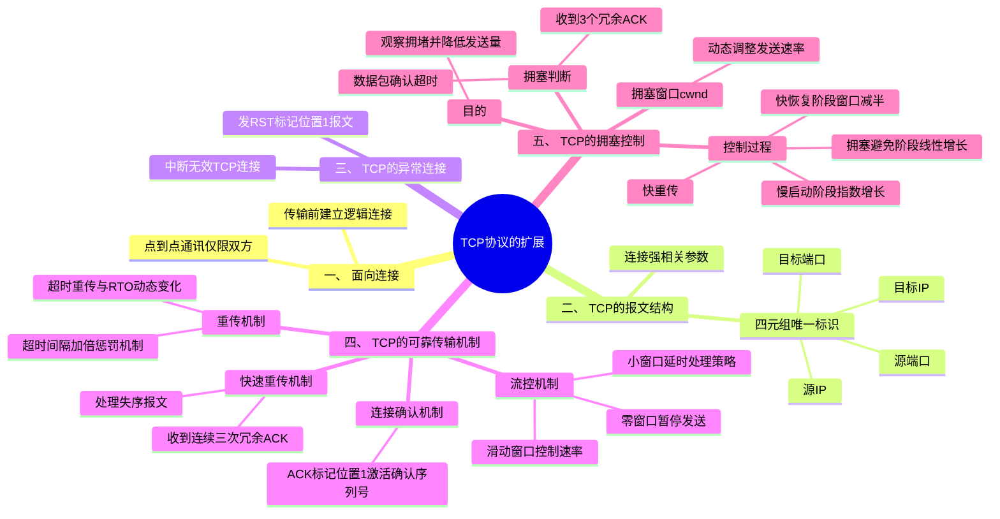

# **一、面向连接**

TCP协议在传输数据的时候，需要**在发送数据之前，先建立一条点到点的连接**。

**点到点**（point to point）：在TCP的通讯中，永远只有通讯双方，而不存在第三方。

**连接：**不是指物理链路上的连接，而是一种**逻辑上**的连接。

# **二、TCP的报文结构**

报文中的一些参数，其作用和我们建立连接是强相关的。

区分不同的TCP连接主要靠四个参数 --- 源IP地址，源端口，目标IP地址，目标端口。所以，这四个参数被称为是TCP连接的“四元组”。四元组可以唯一的标识一条TCP连接。

# **三、TCP的异常连接**

主机就会给发送源发一个TCP报文段，将其中的RST标记位置1。用来中断这次连接。

（一般发送到一个无效的TCP连接时，都会使用RST报文段来终止）。

# **四、TCP的可靠传输机制--****-****连接确认机制，重传，流控、校验和****。**

## **1、连接确认机制**

做法：TCP协议保证对方能够收到本端发送的数据段的方法，就是让对方回复一个确认报文段，

这个确认报文段其最主要的标志就是TCP头部中的一个标记位ACK将置1，同时激活了确认序列号。

## **2、重传机制---超时重传**

**（1）RTT（**Round-Trip Time）往返时间----衡量超时重传的参数

RTT往返时间 --- 指的是发出端将数据发出后，直到接收到对端反馈的确认报文

**（2）RTO（Retransmission Timeout 超时重传时间）**

RTO是一个**动态变化的值**

**（3）超时间隔加倍----惩罚机制**

超时间隔加倍原因：在网络环境拥塞时，如果还是不停的去重传报文段，只会使拥塞加重。所以，TCP采用了这种超时间隔加倍的方式，来缓解这一点。

**（4）快速重传机制**

超时重传的问题就是这个超时间隔会越来越长，这样超长时间的重传间隔，会加重端到端之间的时延。在TCP中，发送方可以通过接收方的反馈，在超时时间到达前，意识到数据包丢失的现象，并进行重传。

失序报文：接受方在收到一个数据段中的序列号大于自己期望的序列号，这就说明自己期望的报文可能在茫茫网海中丢失了。

Ack=上一次的seq+上一次的len

seq=上一次的Ack

**冗余ACK（Duplicate ACK）：**服务器将会通过再次发送携带确认序列号未丢失报文序号的确认报文，并且**连续发送三次**。（如上图所示）TCP就是通过这种方式来告知对端，这个报文已经丢失了，期待对方重传。

## **3、流控机制**

目的：为了防止发送方发送流量过大，导致接收方缓存区溢出的问题

### **（1）滑动窗口**

窗口大小：由接收方通过ACK报文中的窗口字段通知发送方

## **（2）小窗口处理**

零窗口：如果接收方的缓冲区已满，会将窗口大小设置为0，发送方暂停发送数据，直到接收方通知新的窗口大小。

接收方：窗口通告的最小值。这个最小值通常选择MSS或者1/2缓存空间这两个值中较小者。当窗口值小于其二者较小者的值时，将通告窗口值为0。

发送方：而发送方一般的策略是启用延时处理，只有在满足以下两个条件中任意一个时，才会发送数据，否则，将一直囤积数据，直到满足任一条件为止。

1. 条件一：要等到窗口大小 >= MSS 并且 数据大小 >= MSS；
1. 条件二：收到之前发送数据的ack回包；

# **五、TCP的拥塞控制**

## **1、目的：**

TCP会观察网络的拥堵情况，如果网络拥塞严重的话，则将降低发送量，以缓解网络塞情况

## **2、TCP拥塞判断**

**TCP将连接中出现的丢包行为，视为拥塞的表现**。

丢包形式：

1. 就是数据包确认超时；
1. 收到来自接收方发送的3个冗余ACK；

## **3、TCP拥塞控制方法：**

### **（1）拥塞窗口：**

除了接收方的窗口大小，发送方还会维护一个拥塞窗口，用于控制网络拥塞情况下的数据发送速率

拥塞窗口大小：动态调整，拥塞窗口大小可达1---几百个MSS，受到拥塞窗口和接收窗口共同影响，取两者最小值，一般最小是1个MSS

### **（2）拥塞控制方法及过程**

方法：

**过程：**

**初始化阶段：**

**慢启动算法**：在连接刚建立时，拥塞窗口的大小通常初始化为1个MSS，在慢启动阶段，每收到一个应答确认，拥塞窗口大小就会增加a的n次方个MSS，因此拥塞窗口大小呈指数增长。

慢启动门限（ssthresh）：为了防止拥塞窗口增长过大造成网络拥塞

拥塞窗口 < ssthresh，使用慢启动算法；

拥塞窗口  > ssthresh，使用**拥塞避免**算法；

拥塞窗口 = ssthresh，既可以使用慢启动算法，也可以使用拥塞避免算法。

**增长阶段：**

**拥塞避免算法**：当拥塞窗口大小达到慢启动阈值时，TCP进入拥塞避免阶段。在这个阶段，每收到一个ACK确认，拥塞窗口大小增加1个cwnd，因此拥塞窗口大小呈线性增长。

**拥塞发生：**

**快速恢复**：在快速重传之后，TCP进入快速恢复阶段，拥塞窗口大小减半，并继续发送数据

