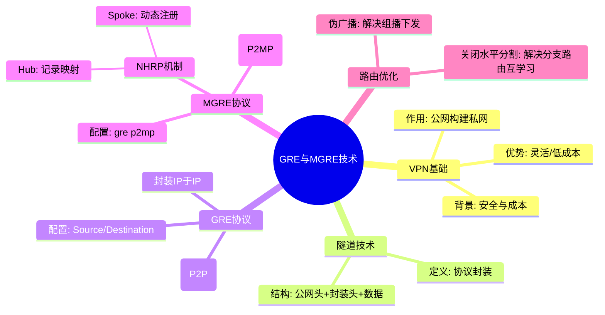

# **一、VPN（virtual private network）---虚拟专用网**

## **1、技术背景**

Internet网络不安全；

通过专线连接分支机构成本高；

PSTN拨号成本高，速率低；


## **2、作用**

利用共享公网构建专有私网---跨越公网，能访问私网主机


## **3、优势**

1. 部署简单快捷；
1. 与私有网络一样提供安全性、可靠性和可管理性；
1. 通过Internet互连，不受地理位置限制，成本低；
1. 简化用户侧的配置和维护工作


## **4、隧道技术**

定义：使用一种协议去封装另一种协议


相关概念：

载荷数据：被封装的原始数据

载荷协议：被封装在内层的协议（私网IP头部）

封装协议：对载荷协议的封装方式（标识用哪种VPN）

承载协议：再次封装的外层协议（公网IP头部）


## **5、分类**

**按使用场景：**

（1）site-to-site vpn：站点到站点的VPN,用于连接不同分支机构的VPN， 双方的公网地址必须是静态的。

IPsec VPN：一种网络层的安全保障技术，在公网上为两个私有网络提供安全通信通道,通过加密通道保证连接的安全。

GRE VPN: 最简单的VPN，一般和 IPsec VPN搭配使用

（2）access vpn:接入vpn，用于把单个移动用户接入到公司内网


L2TP VPN：隧道到传送PPP网络，二层VPN,用 L2TP VPN构建 access VPN----此技术被淘汰

SSL VPN：SSL VPN是解决远程用户访问公司敏感数据，最简单最安全的技术


**按工作层次（OSI参考模型）：**

二层VPN：L2TP VPN、EVPN、VXLAN 、BGP MPLS VPN

三层VPN：

IPSEC  VPN

GRE  VPN

EVPN

VXLAN

BGP MPLS VPN

七层VPN：SSL VPN


**按建设者分：**

运营商：BGP MPLS VPN

用户自建：L2TP VPN、IPSEC  VPN、GRE  VPN、SSL VPN等


# **二、GRE **

## **1、GRE简介**

Genric Routing Encapsulation，通用路由封装，标准的三层隧道技术，是一种点对点的隧道，在任意一种网络协议上传送任意一种其他网络协议的封装方法。

## **2、GRE  VPN**

直接使用GRE封装建立GRE隧道，在一种协议的网络上传送其他协议；

虚拟的隧道接口（Tunnel）

## **3、GRE报文结构**


载荷数据：被封装的原始数据

载荷协议：被封装在内层的协议

封装协议：对载荷协议封装的方式---GRE头

承载协议：再次封装的外层协议


## **4、GRE VPN工作过程**

1. 隧道起点找到私网路由，数据包发往Tunnel口
1. 数据包在Tunel口进行封装隧道使用的协议和公网IP头部
1. 根据公网IP头部查找路由表，并转发
1. 数据包在公网进行传输
1. 查找公网路由并解除公网IP头部封装，交给GRE处理
1. 隧道终点查找私网路由并转发至目的主机


目标：200.2.2.2  源IP：100.1.1.1+GRE+目标IP:192.168.2.1 源IP：192.168.1.1+数据

ip  rou-static 192.168.2.0 24 t0/0/0


## **5、GRE VPN的优缺点**

### **（1）优点**

可以用当前最为普遍的IP网络作为承载网络；

支持多种网络层协议；

支持组播和动态路由协议；

配置简单、部署容易；

### **（2）缺点**

点对点隧道；

静态配置隧道参数；

布置复杂连接关系时，代价巨大；

缺乏安全性；

不能分割地址空间（不能解决私网地址冲突的问题）


## **6、多Tunnel口冗余技术**

作用：主隧道转发数据，备用隧道处于空间状态；需要开启Keepalive（保活机制）来检测隧道运行状态

（1）Tunnel接口虚假状态


（2）Tunnel接口Keepalive


[Huawei-Tunnel0/0/0]keepalive period 5 retry-times 3     //配置隧道保活时间，默认每隔5秒发送一个探测报文---Keepalive报文，3个周期内没有收到就判断tunnel已经down


## **7、GRE  VPN配置----课堂小实验**


```ada
[R1]interface Tunnel 0/0/0      //创建隧道接口
[R1-Tunnel0/0/0]tunnel-protocol gre       //定义隧道的封装协议
[R1-Tunnel0/0/0]ip add 192.168.3.1 24       //配置隧道接口IP地址
[R1-Tunnel0/0/0]source 100.1.1.1      //定义隧道封装需要的公网源IP地址
[R1-Tunnel0/0/0]destination 100.2.2.3   //定义隧道封装需要的公网目标IP地址
```

配置思路：

1、配置IP地址

2、配置全网通---公网通

3、配置GRE VPN

4、配置路由协议，传递私网路由


# **三、MGRE（Multi ****Genric Routing Encapsulation****）**

## **1、简介**

定义：多点通用路由封装协议，适合多个分公司需要和总部连接的情况

特点：通过构建公共隧道实现总部和分部、分部与分部之间的通信

所有私网中，有一方的公网地址必须固定，其他私网公网地址可以不固定


注：静态传递私网路由时，最好写下一跳为真实的隧道地址


## **2、NHRP协议---下一跳解析协议**

### **（1）工作原理**

1. 在私网中选择一个NHRP中心站点，其出口的公网IP必须是固定的；
1. NHRP中心站点要求所有分支都需要将自己物理公网接口IP和隧道IP发给中心站点。（发生变化就需要重新发送。）
1. NHRP中心站点会将所有的分支的地址映射关系动态的记录在本地。发送信息时查询即可
1. 分支之间需要发送信息也需要获取这个映射关系，就需要先问NHRP中心站点要。

### **（2）MGRE VPN配置方法**

```ada
[r1]interface Tunnel 0/0/0 --- 创建GRE随道接口
[r1-Tunnel0/0/0]ip address 192.168.3.1 24  ---- 配置隧道IP地址
[r1-Tunnel0/0/0]tunnel-protocol gre p2mp  ---- 定义封装方式
[r1-Tunnel0/0/0]source 100.1.1.1 ---- 定义隧道被封装的源地址
```

### **（3）NHRP的配置**

中心站点配置：

[R1-Tunnel0/0/0]nhrp network-id 100  创建NHRP域


分支站点配置：

[R2]int Tunnel 0/0/0

[R2-Tunnel0/0/0]ip add 192.168.5.2 24

[R2-Tunnel0/0/0]tunnel-protocol gre p2mp

[R2-Tunnel0/0/0]source GigabitEthernet 0/0/0

[R2-Tunnel0/0/0]nhrp network-id 100   //分支加入中心站点域100

[R2-Tunnel0/0/0]nhrp entry 中心隧道地址 中心公网接口地址 register  // 分支找中心注册自己的信息


## **3、MGRE环境下的RIP网络**

在MGRE环境下使用RIP来获取未知网段的路由信息

1、只有中心获取到分支的路由信息，但是分支并没有获取到中心的路由信息，因为HUB设备不支持发送组播或者广播报文。

解决方法：在中心上开启伪广播

[R1-Tunnel0/0/0]nhrp entry multicast dynamic

2、分支在中心开启伪广播后，分支只能获取到中心的路由信息，但是无法获取分支之间的路由信息；因为RIP默认开启了水平分隔防环机制。

解决方案：关闭接口的水平分割(中心和分支都做)

[R1-Tunnel0/0/0]undo rip split-horizon


# **四、综合实验**

