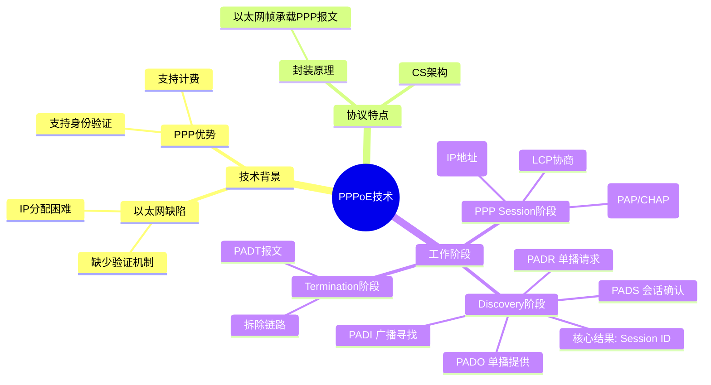

# **一、PPPOE技术背景**

1、以太网接入技术无法提供用户身份验证

2、以太网接入需要实现给用户自动分配公网IP地址

3、以太网接入受到双绞线距离限制

以太网接入图：

大型园区网接入图：

# **二、PPPOE简介**

PPPoE协议采用C/S方式，将ppp报文封装在以太网帧之内，使ppp帧可以在以太网上进行传输，同时让以太网可以具备PPP功能，在以太网上提供点到点的连接

# **三、PPPoE工作的三个阶段**

1、Discovery阶段：协商PPPoE的seession-ID,用来区分不同的逻辑点

（1）由客户端向服务器端广播发送PADI报文，询问PPPoE服务器

（2）PPPoE服务器收到消息后，单播回复一个PADO，告诉客户端由自己给其提供服务

（3）客户端单播发送PADR报文请求PPPoE服务器端提供服务

（4）服务器单播发送PADS报文同意建立会话连接---session id实现

2、ppp session协商阶段：在PPPoE会话中进行ppp协商

1. LCP协商
1. 身份验证
1. NCP协商

3、PPPO
E会话终结，PPPoE断开

当PPPoE客户端希望关闭连接时，会向PPPoE服务器端发送一个PADT（PPPoE Active Discovery Terminate）报文，用于关闭连接。
同样，如果PPPoE服务器端希望关闭连接时，也会向PPPoE客户端发送一个PADT报文。

# **四、实验**

