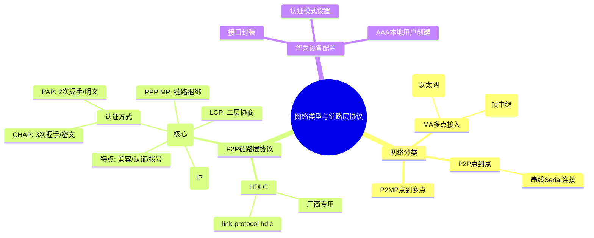

# **一、网络类型的分类（4种）**

出现原因：不同网络类型实际为不同的数据链路层技术，由于二层同时作为了物理层的大脑，故当使用不同数据链路层技术，也将调用不同的物理层设备。

## **1、多点接入网络（MA）------一条网段内上出现多个设备**

1. BMA：广播型多点接入（broadcast）----支持广播，所有设备之间能互访，例如：以太网
1. NBMA（NOn-Broadcas Multi-Access）：非广播型多点接入-----不支持广播，例如：帧中继网络

spoke之间不能互访

spoke和hub之间能互访

## **2、P2MP（点到多点网络）point-to-Multipoint**

特点：

点到多点网络，由其他网络类型手动更改：例如在ospf接口下：ospf network-type 网络类型

模拟组播发送协议报文（帧中继子接口实现的），需要手动指定邻居；[R1-ospf-1]peer 192.168.1.2

## **3、点到点网络（P2P）point-to-point**

特点：

一个网络中只有两台设备

点到点网络的搭建：使用串线连接设备的串线接口（serial），形成一个P2P网络

串线：VAG视频线、console配置线

串线的传输标准：

1. E1标准 --- 传输速率定义为：2.048Mbps --- 欧洲标准
1. T1标准 --- 传输速率定义为：1.544Mbps --- 北美标准

# **二、数据链路层协议**

## **1、MA网络：**

### **（1）以太网协议**

定义：以太网不是一个网络，而是一个协议，传输标准EthernetII 类型帧的网络

特征：多路访问，广播式的网络，需要使用MAC地址对设备进行区分和标识

所属类型：可细分至BMA----因为其支持多点接入和广播行为

构建方法：使用以太网线连接设备的以太网接口，形成的网络是以太网络，所运行的二层协议就是以太网协议

以太网线：同轴电缆、光纤、双绞线

以太网接口：设备一般提供百兆、千兆、万兆接口

以太网特色：可以提供极大的传输速率---频分技术：一根铜丝上其实可以同时发送不同频段的电波而互不干扰，实现数据的并行发送，起到叠加带宽的效果。

## **2、P2P网络：**

### **（1）HDLC协议，****High-Level Data Link Control****--高级数据链路控制协议，**

私有协议，厂商之间不兼容

分类：

标准HDLC：ISO组织根据SDLC（面向比特的同步数据链路控制协议）发展改进而来

非标准HDLC:各个厂家在ISO标准的HDLC上再进行修改而成

注：思科设备默认采用的串线协议是HDLC,华为设备默认采用PPP协议

修改串线协议为HDLC

两边接口下修改链路协议：

[r1-serial4/0/0]link-protocol hdlc

[r1]display interface serial 4/0/0

这里可抓包演示

### **（2）PPP协议，****point to point protocol****--点到点协议**

#### **PPP基本概念：**

1、ppp协议，公有协议，所有厂商兼容，支持同步和异步线路；

同步、异步本质区别：所有电路是否在同一时钟沿下同步地处理数据。

特点：

1. 直连间配置不同网段IP地址可以正常通信
1. ppp协议支持验证，具备错误检测能力，但不具备纠错能力；
1. 对网络层地址进行协商，能够远程动态分配IP地址；（一侧给另一侧设备分配IP地址）

[R1-Serial4/0/0]ip address ppp-negotiate      //开启地址协商功能

[R2-Serial4/0/0]remote address 12.0.0.2      //为远程主机分配IP地址

1. ppp兼容性较好，可同时支持多种网络层协议；
1. 无重传机制，网络开销小；

#### **ppp数据帧封装结构---了解**

1. Flag:固定长度8位，固定取值：0X7E，标识一个物理帧的起始和结束，该字节为二进制序列01111110（0X7E）
1. address:固定长度8位，固定取值：0XFF，该字节二进制为11111111 （0XFF），是一个广播地址，默认指目标MAC地址
1. control:固定长度8位，固定取值：0X03，该字节二进制为00000011（0X03），表明为无序号帧。这种帧用于在无连接、不可靠的模式下传输数据，不进行序列号和确认，为了兼容HDLC协议，没啥实际意义。
1. protocol：协议字段，表明其信息部分所采用的协议类型（LCP/NCP）
1. Information：数据

Code：标识不同类型LCP报文，

Identifier：标识，为1个字节，用来匹配请求和响应。

Length：就是该LCP报文的总字节数据。

Data：承载各种TLV（Type/Length/Value）参数用于协商配置选项，包括最大接收单元（MRU=MTU），认证协议，魔术字等等。

魔术字：检测链路环路和其他异常情况。魔术字是随机产生的一个数字，随机机制需要保证两端产生相同魔术字的可能性几乎为0。

1. FCS：帧校验序列---确保数据完整性

#### **ppp协议的组成：**

主要由LCP、NCP以及用于网络安全的可选验证协议族组成

LCP：链路控制协议--主要是完成ppp会话建立第一阶段的协商协议

NCP：网络控制协议：完成ppp会话建立的第三阶段，针对网络层协议进行协商，地址动态协商（IPCP---IP协议的控制协议）

#### **ppp工作过程：**

总结：

1. 链路建立阶段--LCP建立：通过相互发送LCP协议数据包来商议，如：MTU、是否需要认证，以及使用什么方法认证、链路通信模式、接口速率
1. 认证阶段--ppp认证（可选项）
1. 网络层协议协商阶段--NCP协商---IP地址协商

#### **ppp会话流程：（了解）**

#### **PPP验证：**

**方式一：PAP验证**

1. 被验证方首先发起验证请求，两次握手验证；
1. 用户名、密码以明文传送；
1. 支持单、双向认证；

**方式二：CHAP验证**

1. 主验证方首先发起验证请求，三次握手验证；
1. 不发送密码，安全性PAP高；
1. 支持单、双向认证；

注：此加密是通过一些算法加密

#### **ppp配置命令总结**

主验证方：配置用户列表及验证方式

[R2]aaa

[R2-aaa]local-user wangdaye password cipher wdy12345  privilege level 15     //设置验证用的账号和密码

[R2-aaa]local-user wangdaye service-type ppp    //设置主验证方提供的服务类型

[R2]int Serial 3/0/0

[R2-Serial3/0/0]ppp authentication-mode chap/pap    //设置验证类型（方式）

[R2-Serial3/0/0]link-protocol ppp //设置接口报文的封装模式

被验证方：配置验证用户名

[R1]interface Serial 3/0/0

[R1-Serial3/0/0]ppp chap user wangdaye   //告知被验证方，验证的方式及用户名和密码

[R1-Serial3/0/0]ppp chap password cipher wdy12345

**[R2-Serial3/0/0]ppp pap local-user wangdaye password cipher wdy1234**

#### **ppp mp简介：**

MP（multilink ppp），将多个ppp链路捆绑后，当做一条链路使用；

MP可以实现增加带宽、负载分担、链路备份以及降低报文时延的目的

配置方式：用MP-GROUP配置

配置示例：

# **四、实验作业（ppp实验）**

